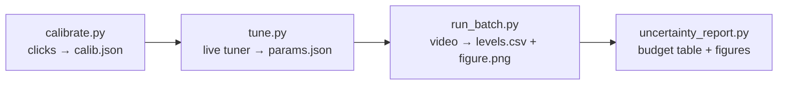

# cylinder-level-vision

**Read liquid and foam levels in a graduated cylinder from a video, with a full uncertainty budget.**

<p align="center"></p>

*The live tuner on a back-lit green-screen run (frame 108, t = 216.2 s): specimen, highlight, signed vertical gradient, threshold mask and the info strip. Liquid 213.3 mL, liquid + foam 653.6 mL, foam 440.3 mL.*

[](https://www.python.org/)
[](LICENSE)
[](#tests)
[](requirements.txt)

The tool was written for a physics-tournament experiment at École Polytechnique (following the beer and foam levels in a 1000 mL cylinder during and after a pour), but nothing in it is specific to beer: any vertical graduated cylinder filmed by a fixed camera, with one or two horizontal interfaces, can be read.

## What it does

- **Calibrates the scale from clicks** — click the graduations once on a still frame; three row-to-volume models (PCHIP, quadratic, Möbius) are fitted and checked.
- **Detects two interfaces per frame** from the vertical intensity gradient $G_y = \partial I/\partial y$: the *lower* interface (liquid/foam) and the *upper* one (foam/air), each averaged over a band of columns around the cylinder axis.
- **Batches a whole video** into a CSV (row, volume and per-frame spread of each interface) and a $V(t)$ figure, one frame in $K$.
- **Quantifies the uncertainty** of every reading: calibration, pixel quantisation, cylinder curvature (a graduation is a circle, not a line) and the empirical spread of the detector, combined in quadrature.



## The two lighting setups and the `polarity` parameter

The detector only looks at the sign of $G_y$. Which sign belongs to which interface depends on the lighting, so one parameter, `polarity`, tells it.

<table>
<tr>
<td align="center" width="62%"><br><em>Front-lit, black background (frame 2472, t = 124.2 s): bright white foam over dark beer, dark air above.</em></td>
<td align="center" width="38%"><br><em>Back-lit green screen (frame 108, t = 216.2 s): the beer transmits the light, the foam scatters it and looks dark.</em></td>
</tr>
</table>

Image rows grow **downwards**, so $G_y > 0$ where the picture gets brighter going down.

| `polarity` | setup | lower interface (liquid/foam) | upper interface (foam/air) |
|---|---|---|---|
| `lower_darker` | front-lit, black background | dark beer under bright foam → $G_y < 0$ | bright foam under dark air → $G_y > 0$ |
| `lower_brighter` | back-lit green screen | bright beer under dark foam → $G_y > 0$ | dark foam under bright air → $G_y < 0$ |

The two interfaces always have opposite signs, so the code works on $S = \pm G_y$ (sign $-1$ for `lower_darker`, $+1$ for `lower_brighter`): the lower interface is always a positive peak of $S$ (drawn in red), the upper one a negative peak (drawn in cyan).

<table>
<tr>
<td align="center" width="50%"><br><em><code>lower_darker</code> on the black run: red blob at the beer/foam interface (y = 845.7 px, 161/161 columns, 148.6 mL), cyan blobs at the foam top (y = 159.8 px, 203/227 columns, 729.9 mL).</em></td>
<td align="center" width="50%"><br><em><code>lower_brighter</code> on the green run: same colours, flipped physics. Lower y = 1487.8 px (213.3 mL), upper y = 722.4 px (653.6 mL, 18/129 columns). The base of the cylinder shows up as a second red/cyan pair at the very bottom, inside the y_bottom mask.</em></td>
</tr>
</table>

<p align="center"></p>

*The same green-screen frame with the wrong polarity (left) and the right one (right). With `lower_darker` the detector locks on the wrong sign: it reports the base edge as the "lower" interface (y = 1746.4 px, 66 mL) and the real beer/foam interface as the "upper" one (y = 1495.9 px, 209 mL). With `lower_brighter`: 213 mL and 654 mL.*

## Install

```bash
git clone https://github.com/<you>/cylinder-level-vision.git
cd cylinder-level-vision
pip install -r requirements.txt      # opencv-python, numpy, scipy, matplotlib
pip install -e .                     # optional: import cylvision from anywhere
```

Python 3.10 or newer. The interactive tools open OpenCV and Tkinter windows; the library and the tests do not need a display.

## Quick start

```bash
# 1. click the graduations on one frame  ->  runs/pour/calib.json + calibration_check.png
python scripts/calibrate.py --video pour.mp4 --cylinder 1000 --back --out runs/pour

# 2. tune the detector live               ->  runs/pour/params.json
python scripts/tune.py --video pour.mp4 --run-dir runs/pour --polarity lower_brighter

# 3. process the video                    ->  runs/pour/levels.csv + meta.json + figure.png (±u bands)
python scripts/run_batch.py --video pour.mp4 --run-dir runs/pour --step 5

# 4. (optional) uncertainty budget         ->  runs/pour/uncertainty_*.png + uncertainty.json
python scripts/uncertainty_report.py --run-dir runs/pour --video pour.mp4 --frame 108
```

If the video was already sub-sampled (for example one frame in 60 of a long recording, keeping the source fps in the metadata), pass `--frame-scale 60` to `tune.py` and `run_batch.py` so that the frame counter and `t_sec` show the source time.

## Tool 1 — Scale calibration (`scripts/calibrate.py`)

One still frame, a handful of clicks. The script asks, in order, for the **left** and **right** edges of the cylinder (the crop band), the **top** and **bottom** rows (`y_top` / `y_bottom`, the gradient masks), then every graduation of the preset. Pixel-accurate pointing is the whole point, so the cursor is a *logical* cursor with a ×8 loupe.

<p align="center"></p>

*Prompt 8 of 14 on the green run: the four ROI clicks are placed (left 361, right 675, y_top 5, y_bottom 1869) and the 100, 200 and 300 mL graduations are marked in orange; the cursor sits at (527, 1163) on the 400 mL ring, magnified ×8 in the top-left loupe.*

| key / action | effect |
|---|---|
| mouse | moves the cursor 1:1 |
| **Shift** + mouse | damped pointer: one logical pixel every few mouse pixels |
| arrows | nudge by exactly 1 px (the mouse is ignored for 400 ms afterwards) |
| **Space** or left click | place the point at the logical cursor |
| `f` | toggle a 1:1 fullscreen window |
| `s` | skip a graduation that lies outside the frame |
| `z` | undo the last point |
| **Enter** | validate (all prompts answered, at least three graduations) |
| **Esc** | abort |

Three models are fitted on the clicks $(y_i, V_i)$:

| model | form | behaviour |
|---|---|---|
| PCHIP | monotone cubic interpolation | exact at the clicks, follows any irregularity of the printed scale |
| poly2 | $V = a y^2 + b y + c$ | smooth, absorbs one noisy click |
| Möbius | $V = \dfrac{a y + b}{c y + 1}$ | the exact pinhole + tilt law; $c = 0$ means no camera pitch |

`best_model` keeps **poly2 when its RMS residual is ≤ 0.3 mL**, otherwise **PCHIP**. On both runs below poly2 lands at 0.56–0.58 mL, so the calibration honours the actual rings with PCHIP.

<table>
<tr>
<td align="center" width="50%"><br><em>Green run (1080 × 1920 frame, crop 325 × 1920): 10 clicks from 100 to 1000 mL. RMS: PCHIP 0.00, poly2 0.58, Möbius 0.58 mL.</em></td>
<td align="center" width="50%"><br><em>Black run (1920 × 1080 frame, crop 237 × 1080): 8 clicks from 100 to 800 mL. RMS: PCHIP 0.00, poly2 0.56, Möbius 0.60 mL.</em></td>
</tr>
</table>

The three panels of `calibration_check.png`: the annotated frame with every graduation line predicted by the recommended model (green = clicks, orange = 50 mL marks, grey = 10 mL marks), the crop band alone, and $V(y)$ for the three models with their residuals.

`calib.json` keys: `image_ref`, `image_size`, `cylinder` (spec), `x_left`, `x_right`, `y_top`, `y_bottom`, `graduations_ml`, `graduations_px_y`, `graduations_px_x`, `skipped_ml`, `poly2_coef`, `mobius_popt`, `mobius_pcov`, `residuals_ml`, `recommended_model`, and with `--back`: `graduations_px_y_back`, `graduations_px_x_back`, `back_calibration_frame`. Legacy files with a sibling `crop.json` are read transparently.

**Presets** (`cylvision/calibration/store.py`):

| preset | graduations to click (mL) | inner radius | scale step |
|---|---|---|---|
| `50` | 5, 10, 20, 30, 40, 50 | 1.35 cm | 1 mL |
| `1000` | 100, 200, …, 1000 | 3.20 cm | 10 mL |

Any other cylinder: `--cylinder custom --graduations 25,50,75,100 --radius-cm 1.8 --name "100 mL"`. The radius only feeds the curvature term of the uncertainty budget; `--back` (click the same rings on the back face) makes the budget independent of it.

## Tool 2 — Interface tuner (`scripts/tune.py`)

The tuner shows one frame through the detector and lets you move every parameter while watching the result.

<p align="center"></p>

*Stacked layout on the black run (frame 2472): specimen and highlight on the first row, gradient and mask on the second, info strip below. Liquid 148.6 mL, liquid + foam 729.9 mL, foam 581.3 mL.*

Three analysis panels:

| panel | what it shows |
|---|---|
| **Highlight** | the crop with the per-column detections (dots), the mean rows (red = lower, cyan = upper), the band edges (orange/yellow), the axis `cx` (thin white line) and the `y_top` / `y_bottom` masks (magenta) |
| **Signed gradient** | the heat map of $S = \pm G_y$ after Gaussian and horizontal smoothing: red = lower-interface sign, cyan = upper-interface sign |
| **Threshold mask** | $S > T_\text{lower}$ in red and $-S > T_\text{upper}$ in cyan — what the detector is allowed to pick |

The **info strip** repeats the parameters and prints, for each interface, the mean row, its per-column spread, the number of valid columns in the band, and the volumes `V_liquid`, `V_total`, `V_foam` through the calibration.

**Two ordered passes.** The lower interface is found first: per column, the row of the maximum of $S$, validated by $S > T_\text{lower}$, averaged over $|x - c_x| \le r_\text{lower}$. The upper interface is then searched **bottom-up from $y_\text{lower}$**: the first row where $-S > T_\text{upper}$, averaged over $|x - c_x| \le r_\text{upper}$. Foam is porous and every bubble edge creates a small gradient of the "upper" sign, so a raw per-column argmax would pick a random bubble somewhere inside the foam; scanning upwards from the liquid returns the *lowest* transition above threshold, which is the foam top. A **connected-component filter** (`min_h_upper`) removes the isolated 1–2 px bubble edges from the cyan mask before the scan, keeping only blobs at least that many rows tall.

## Control panel, parameter by parameter

<p align="center"></p>

*The Tk panel in two-column layout, loaded with the green-run parameters (`lower brighter`, T 16/16, r 64/64, σ 5.7, blur_h 38, min_h 3, y 5..1869, cx 157, gray, every frame).*

### VIEW (blue)

| widget | what it does | when to change it |
|---|---|---|
| `specimen panel` — radio [off \| **on**] | shows the full frame with the two interfaces and a brace between them | turn off on a small screen to give the analysis panels more room |
| `panels` — radio [stacked \| **inline (1 row)**] | one row of panels, or two rows | stacked suits a short, wide crop (landscape video) |

### CYLINDER (mauve)

| widget | range · default | what it does | when to change it |
|---|---|---|---|
| `y_top` | 0..H−1 · from `calib.json` | zero the gradient above this row (glass rim) | if the rim or the pouring stream shows up in the mask |
| `y_bottom` | 0..H−1 · from `calib.json` | zero the gradient below this row (base, table) | if the base edge shows up in the mask |
| `cx` | 0..W_crop−1 · W_crop // 2 | axis column *inside the crop*, centre of both bands | if the crop is not centred on the cylinder |
| `frame` (video only) | 0..N−1 | the frame shown | to check the parameters on a pour, a plateau, a collapse |

<p align="center"></p>

*`y_top` 200 vs 34 (black run). The rim of both test cylinders lies outside the frame, so the mask is shown the other way round: a `y_top` below the foam top (magenta line at 200) masks the true upper interface and the detector reports nothing (0 columns); at 34 the foam top is found at y = 159.8 px (730 mL). The lower interface is unaffected (845.7 px in both cases).*

<p align="center"></p>

*`y_bottom` 1079 (no mask), 800 (too high) and 1031 (tuned), black run. Without the mask the bright edge of the base appears as a cyan blob at the bottom of the mask — harmless here, but it is what the upper-interface scan would fall on whenever the lower interface is lost. At 800 the mask covers the beer/foam interface itself (0 columns). The effect of the mask on these particular frames is otherwise nil: 845.7 / 159.8 px in both valid cases.*

<p align="center"></p>

*`cx` 40 vs 157 (green run). With the axis shifted to the left wall the band is clipped to 81 columns near the glass, where the meniscus and refraction bend the interface: lower 1479.5 px (218 mL) instead of 1487.8 px (213 mL), and the upper interface is not found at all. Centred, 129 columns and both interfaces.*

### GRADIENT (teal)

| widget | range · default | what it does | when to change it |
|---|---|---|---|
| `polarity` — radio [**lower darker** \| lower brighter] | | sign convention of both interfaces (see above) | front-lit black background → lower darker; back-lit → lower brighter |
| `T_lower` | 0..500 · 40 | threshold on $S$ for the liquid/foam interface | raise until the red mask keeps only the interface |
| `T_upper` | 0..500 · 47 | threshold on $-S$ for the foam/air interface | raise if the cyan mask has blobs inside the foam |
| `r_lower` | 0..r_max · min(80, r_max) | half-width of the averaging band of the lower interface | narrow if the walls bend the interface; `r ≥ W_crop // 2` = whole width |
| `r_upper` | 0..r_max · min(80, r_max) | same for the upper interface | independent of `r_lower` |
| `blur_sigma × 10` | 0..100 · 5.0 | Gaussian smoothing (σ in px) before the Sobel derivative | raise if bubble edges compete with the interface |
| `blur_h` | 0..101 · 38 | horizontal box filter width (px), 0 = off | keep on for foam; it averages each row along $x$ |
| `min_h_upper` | 0..50 · 3 | minimum blob height of the cyan mask (0/1 = off) | raise during a pour with big bubbles |
| `channel` — radio [**gray** \| G \| R \| B] | | grey level fed to the detector | pick the channel that carries the contrast of your lighting |

<p align="center"></p>

*`T_lower` 4 vs 16 (green run). Both values give the same interfaces (1487.8 / 722.4 px, 129 columns) because the argmax already lands on the true interface, but at 4 the red mask is littered with weak gradients in the foam and below the beer — every one of them a candidate the moment the interface weakens. 16 keeps only the interface.*

<p align="center"></p>

*`T_upper` 4 vs 14 (black run). The bottom-up scan stops on the first row above threshold: at 4 it stops on bubble reflections right above the beer, y = 465.9 px (465 mL) instead of the foam top at 159.8 px (730 mL). The cyan mask on the left shows the ladder of false candidates it climbed.*

<p align="center"></p>

*`r_lower` 10, 64 and 157 (green run). A narrow band uses 21 columns (1488.3 px); the tuned band 129 columns (1487.8 px); the whole width 291 columns and the mean drops to 1505.1 px (203 mL instead of 213 mL) because the columns near the walls follow the meniscus.*

<p align="center"></p>

*`blur_sigma` 0.5 vs 5.7 (green run). With almost no smoothing every bubble edge beats the interface: the mask is a cloud of strokes, the lower interface is reported at 1289.1 px (328 mL) inside the foam and the upper one at 988.9 px (501 mL). At 5.7 the interface is spread over a few rows and wins everywhere: 1487.8 px (213 mL) and 722.4 px (654 mL).*

<p align="center"></p>

*`blur_h` 0 vs 38 (black run). The horizontal box filter averages each row along $x$, keeping horizontal interfaces and washing out the vertical texture of the foam: the cyan blobs in the foam disappear, the upper interface moves from 170.1 px (721 mL, 217 columns) to 159.8 px (730 mL, 203 columns). The lower interface does not move (845.7 px).*

<p align="center"></p>

*`min_h_upper` 0 vs 3 (green run, frame 30 at t = 60 s, during the pour: 25 mL of liquid under a tall foam full of large bubbles). Without the filter the bottom-up scan stops on thin bubble edges inside the foam, y = 931.4 px (534 mL); with blobs at least 3 rows tall it reaches the foam top at 812.7 px (602 mL) — a 119 px, 68 mL difference.*

<p align="center"></p>

*`channel` gray / G / R (green run). Gray and G give the same lower interface (1487.8 vs 1488.0 px); G has more contrast on a green screen and validates 119 upper columns instead of 18, at a slightly different row (734.3 vs 722.4 px). R carries almost no signal: the gradient panel is noise and nothing passes the thresholds.*

### SAMPLING (peach)

| widget | range · default | what it does |
|---|---|---|
| `preset` — radio [**all** \| 1/2 \| 1/3 \| 1/5 \| 1/10] | | sets `frame_step` to 1, 2, 3, 5 or 10 |
| `frame_step` — "1 frame in K" | 1..60 · 1 | the batch analyses one frame in K |

### Buttons and hotkeys

**▶ Run batch** saves `params.json` (parameters + `frame_step`) and prints the batch command; **✖ Abort** leaves the run directory untouched; **⇄ 1/2 columns** rebuilds the panel in one or two columns. The footer shows the hotkeys of the OpenCV window and a one-line summary of the current values.

| key | effect |
|---|---|
| **Enter** | accept the parameters and run the batch |
| **Esc** | abort |
| `t` | toggle the specimen panel |
| `l` | toggle inline / stacked |
| `f` | fullscreen |
| ← → (or `a` / `d`) | previous / next frame |
| **Home** (or `0`) | first frame |
| **Space** | play / pause |

## Tool 3 — Batch (`scripts/run_batch.py`)

Reads `calib.json` and `params.json`, processes frames `--start .. --end` one in `--step` (default: the `frame_step` saved by the tuner) and writes the run directory:

| file | written by | content |
|---|---|---|
| `calib.json` | `calibrate.py` | crop band, masks, clicks, fitted models |
| `calibration_check.png` | `calibrate.py` | the verification figure above |
| `params.json` | `tune.py` | `DetectionParams` + `frame_step` |
| `levels.csv` | `run_batch.py` | one row per frame (NaN rows for skipped frames keep the time axis aligned) |
| `meta.json` | `run_batch.py` | video, frame range, step, parameters, timings, summaries, the Markdown budget table (`uncertainty_budget`) |
| `figure.png` | `run_batch.py` | $V_\text{lower}(t)$, $V_\text{total}(t)$, $V_\text{foam}(t)$ with the $\pm u_\text{total}$ bands of the uncertainty budget (drawn whenever the calibration carries the cylinder radius; otherwise the batch says so and draws the lines alone) |
| `uncertainty_curvature.png`, `uncertainty_schematic.png`, `uncertainty_budget.png` | `uncertainty_report.py` | the figures of the budget section |
| `uncertainty.json` | `uncertainty_report.py` | geometry, per-volume table, notes, method summary |

`levels.csv` columns:

| column | meaning |
|---|---|
| `frame_idx`, `t_sec` | frame index and time (× `--frame-scale` for a pre-subsampled video) |
| `y_lower_px`, `std_lower_px`, `n_lower` | mean row of the liquid/foam interface, its per-column standard deviation, valid columns |
| `y_upper_px`, `n_upper` | mean row of the foam/air interface, valid columns |
| `V_lower_mL` | liquid volume, $V(y_\text{lower})$ |
| `V_total_mL` | liquid + foam, $V(y_\text{upper})$ |
| `V_foam_mL` | $V_\text{total} - V_\text{lower}$ |
| `u_method_lower_mL`, `u_method_upper_mL` | per-frame method uncertainty of each interface (see below) |

<p align="center"></p>

*Green run, $V_\text{lower}(t)$ at `frame_step` 1 (line) and 10 (circles): sub-sampling ten times does not change the curve. The spike at the start is the pour crossing the band.*

<table>
<tr>
<td align="center" width="50%"><br><em>Green run, frames 0..1120 (1 frame = 60 source frames), 1121 rows, both interfaces found on 1121 / 1118 of them. Liquid + foam peaks at 749.5 mL, the liquid settles on a ~250 mL plateau then drifts to 227.9 mL, the foam decays from 746.6 mL to 131.2 mL after 37 min.</em></td>
<td align="center" width="50%"><br><em>Black run, frames 972..40000 step 60, 651 frames analysed. Liquid + foam peaks at 776.4 mL and ends at 278.9 mL; the liquid plateau is 253.1 mL; the foam decays from 746.7 mL to 25.8 mL in 33 min.</em></td>
</tr>
</table>

Both figures carry the $\pm u_\text{total}$ band of the uncertainty budget (about 3 mL), which is barely wider than the lines at this scale. The liquid curve of the green run gets noisier after t ≈ 1800 s as the interface loses contrast; the per-frame `u_method_lower_mL` column records it.

## Uncertainty budget

Every volume comes with a standard uncertainty ($k = 1$) built from four independent terms. The full derivation is in [`docs/uncertainty.md`](docs/uncertainty.md); this is the summary. Whenever a quantity is only known to lie in an interval of width $w$, the uniform-distribution rule $u = w / \sqrt{12}$ is used.

**Calibration.** The RMS residual of the recommended model, floored by the resolution of the printed scale ($\delta_s$ = the thin step, 10 mL on a 1000 mL cylinder):

$$u_\text{cal} = \max\left(\sqrt{\tfrac{1}{n}\sum_i \varepsilon_i^2},\; \frac{\delta_s}{\sqrt{12}}\right) = 2.89\ \text{mL on the 1000 mL runs.}$$

**Pixel quantisation.** A row is an integer; with the local slope $s(V) = |dV/dy|$ (≈ 0.57 mL/px here):

$$u_\text{px}(V) = \frac{1\ \text{px}}{\sqrt{12}}\; s(V) \approx 0.16\ \text{mL}.$$

**Cylinder curvature.** A graduation, or the interface, is a horizontal *circle* of radius $R$; a camera at distance $D$ sees it as an arc of ellipse, so the columns of the band sample different rows. The full vertical span of the arc inside the band, $\Delta(V)$, is treated as a uniform reading error:

$$u_\text{curv}(V) = \frac{\Delta(V)}{2\sqrt{3}}\; s(V), \qquad \Delta \approx |v_\text{click} - c_y| \left(\frac{r}{f}\right)^2 \frac{1-\rho}{2\rho}\quad (\rho = R/D).$$

$\Delta$ vanishes on the **camera horizon** (the row $c_y$ where the circle is seen edge-on), grows linearly away from it and quadratically with the band half-width $r$. The geometry ($\rho$, $c_y$, $f$, pitch $\alpha$) is recovered from the calibration alone: with front **and back** clicks the two rows of the same ring give $\rho = (s_f - s_b)/(s_f + s_b)$ and the horizon is where the two lines cross — no focal length, no physical radius (`focal_free`); with front clicks only, the radius preset and the Möbius $c$ coefficient are used instead (`mobius_tilt`).

<p align="center"></p>

*Green run geometry (R = 3.20 cm, D = 35.1 cm, f = 1716 px, ρ = 0.091, α = 0, focal-free): (a) top view, the ±22.0° band samples a piece of the ±84.8° visible arc; (b) side view, the camera looks along the 500 mL ring; (c) the 1000 mL ring projected as an ellipse, Δ = 6.1 px across the band.*

<p align="center"></p>

*Left: the projected circle of every graduation over the real frame (front clicks in blue, back clicks in red), curving up below the horizon (y ≈ 955 px, V ≈ 520 mL) and down above it. Centre: the Δ wedge and $u_\text{curv}(V)$: 0.04 mL at 500 mL, 0.87 mL at 100 mL, 0.99 mL at 1000 mL. Right: top and side views of the recovered geometry.*

**Method.** For each frame and interface, the valid per-column rows are converted to volumes, columns farther than $t$ = 7 mL from the mean are dropped (a column that jumped to a bubble is a failure of the method, not a property of the interface), and the spread of the rest gives

$$u_\text{method,frame} = \frac{|V(y_\text{up}) - V(y_\text{lo})|}{2\sqrt{3}}.$$

The run-level value is the **median** over the frames.

<p align="center"></p>

*Lower interface of the green run (frame 108, zoom ×3): 129 per-column detections (red dots) around the mean row 1487.77 px (213.3 mL), bounds 1485 px (214.9 mL) and 1490 px (212.0 mL), range 2.87 mL, $u_\text{method}$ = 0.83 mL on this frame; the run median is 0.99 mL.*

**Total**, in quadrature:

$$u_\text{total}(V) = \sqrt{u_\text{cal}^2 + u_\text{px}(V)^2 + u_\text{curv}(V)^2 + u_\text{method}^2}.$$

<p align="center"></p>

*Green run: contributions and total versus volume (left) and the share of the variance (right). The scale resolution dominates everywhere; curvature only matters at the ends of the cylinder; the pixel term is negligible.*

| V (mL) | u_cal | u_px | u_curv | u_method | **u_total** |
|---:|---:|---:|---:|---:|---:|
| 100 | 2.89 | 0.16 | 0.87 | 0.99 | **3.18** |
| 250 | 2.89 | 0.17 | 0.56 | 0.99 | **3.11** |
| 500 | 2.89 | 0.17 | 0.04 | 0.99 | **3.06** |
| 750 | 2.89 | 0.16 | 0.48 | 0.99 | **3.09** |
| 1000 | 2.89 | 0.16 | 0.99 | 0.99 | **3.21** |

*Green run, 1000 mL cylinder, r = 64 px, PCHIP calibration, method term = median of `u_method_lower_mL` over 955 frames (mean 0.96, p95 1.47 mL).*

```bash
python scripts/uncertainty_report.py --run-dir runs/pour --video pour.mp4 --frame 108
# options: --r-px 64  --alpha-deg 0  --no-back  --levels-csv other.csv  --volumes 100,250,500,750,1000
```

The report prints the geometry and the Markdown table above and writes `uncertainty_curvature.png`, `uncertainty_schematic.png`, `uncertainty_budget.png` and `uncertainty.json` into the run directory. The method term is read from `levels.csv`; without a batch the budget carries a placeholder and says so.

## Project layout

```
cylinder-level-vision/
├── cylvision/
│   ├── io.py                  unicode-safe image IO, VideoSource, key codes
│   ├── magnifier.py           ×8 loupe for pixel-accurate clicks
│   ├── calibration/           models.py (PCHIP / poly2 / Möbius), clicks.py, back_clicks.py,
│   │                          store.py (Calibration, PRESETS, JSON), check.py (verification figure)
│   ├── detection/             gradient.py (Sobel, masks), interfaces.py (DetectionParams, two-pass
│   │                          detector), panels.py (highlight / gradient / mask, info strip)
│   ├── ui/                    theme.py, controls_panel.py (Tk), frame_picker.py, tuner.py
│   ├── pipeline/              run_store.py (run directory), batch.py (CSV rows), plot.py (V(t))
│   └── uncertainty/           curvature.py (camera geometry, Δ), empirical.py (method), budget.py
├── scripts/                   calibrate.py · tune.py · run_batch.py · uncertainty_report.py ·
│                              make_readme_figures.py
├── docs/                      uncertainty.md (full derivation) · images/ (every README figure + manifest)
├── tests/                     pytest, synthetic images only
├── SPEC.md                    internal engineering spec
├── pyproject.toml · requirements.txt · LICENSE
```

## Tests

```bash
pip install -e ".[dev]"
python -m pytest -q          # 72 passed in ~2 s
```

The tests need no video and no display: synthetic three-band crops (air / foam / liquid, both polarities, with noise) check that the detector finds both interfaces within ±2 px and that swapping the polarity breaks it; the calibration models, the legacy JSON layouts, the curvature geometry (Δ = 0 on the horizon, symmetric growth, $u = \Delta/(2\sqrt{3})$), the empirical spread and the batch/CSV round trip are covered as well.

## Regenerating the figures

Every image in `docs/images/` comes from a real run and is described, with its frame and parameters, in [`docs/images/README_figures.json`](docs/images/README_figures.json). To rebuild them from two run directories (a green-screen run with `lower_brighter` and a black-background run with `lower_darker`):

```bash
python scripts/make_readme_figures.py \
    --green-run runs/green --green-video green.mp4 \
    --black-run runs/black --black-video black.mp4 \
    --out docs/images --panel-screenshot
# --only param_T_lower,hero   regenerate a subset
# --skip-batch                reuse the cached batch CSVs from --work-dir
```

## License

MIT — see [LICENSE](LICENSE). © 2026 Camille Duparc.
