# liquid-foam-interface-volume-detector

**Point a camera at a graduated cylinder; get the liquid level, the foam level and their volumes, frame by frame, with an uncertainty budget.**

<p align="center">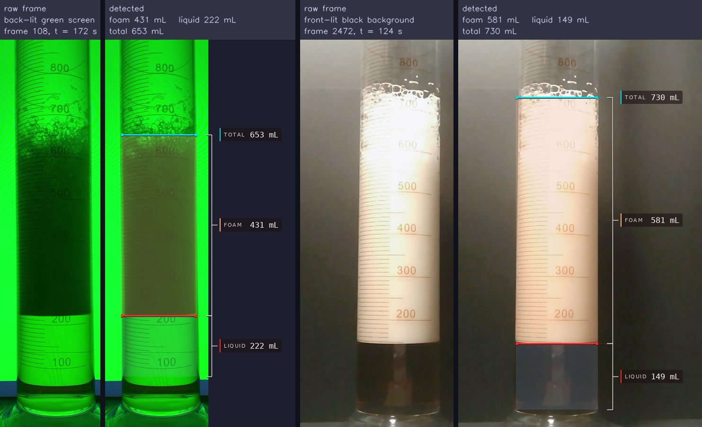</p>

*Raw frame → detected, on the two lighting setups. The tool finds the **liquid/foam interface** (red line) and the **foam/air interface** (teal line), shades the foam band between them (peach) and the liquid below (blue), and converts both rows to volumes through the printed scale — the readouts next to the braces. Left pair: back-lit green screen, frame 108 (t = 172 s after the start of the pour) — foam 431 mL, liquid 222 mL, total 653 mL. Right pair: front-lit black background, frame 2472 (t = 124 s) — foam 581 mL, liquid 149 mL, total 730 mL.*

<p align="center">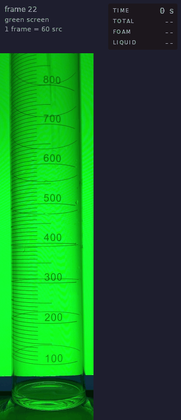</p>

*The green-screen run through the detector, from the pour to after the foam collapse (15 frames, 1 frame = 60 source frames, times from the start of the pour): the readout in the header gives t and the three volumes of every frame; the static strip below shows the same frames for viewers whose browser does not play GIFs.*

[](https://www.python.org/)
[](LICENSE)
[](#tests)
[](requirements.txt)

## The foam, over time

<p align="center">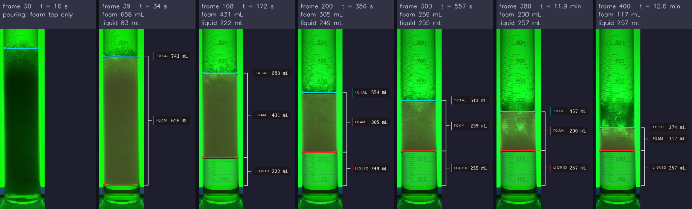</p>

*Seven frames of the green-screen run (1 frame = 60 source frames; t = 0 at the start of the pour, sub frame 22). While the beer is still being poured (frame 30, t = 16 s) only the foam top is visible; at the foam peak (frame 39, t = 34 s) the band is 658 mL over 83 mL of liquid. It then shrinks to 431 mL (t = 172 s), 305 mL (356 s), 259 mL (557 s) and 200 mL (11.9 min) while the liquid drains out of it and settles at 257 mL; between frames 380 and 400 (12.6 min) an 83 mL slab of foam collapses and the band drops to 117 mL. Every panel is the specimen view of the tuner: the two flat mean lines with their triangles at the cylinder walls, the shaded foam and liquid zones, the braces and the readouts.*

Every overlay in this README uses the same code: **red** = lower interface (liquid/foam), **teal** = upper interface (foam/air), **peach wash** = foam, **blue wash** = liquid. The lines are drawn at the output resolution (3 px flat, a 1 px shadow underneath) so they stay crisp whatever the size of the figure; small dots along each line are the per-column detections that the mean line averages. The readouts use the TrueType fonts shipped with matplotlib (DejaVu Sans for the zone words, DejaVu Sans Mono for the numbers).

## Background

This project was built for the **internal selection of the École Polytechnique team for the IPT** (International Physicists' Tournament). Each candidate had to present, in six minutes, an experimental study of one of the tournament problems, with a real uncertainty analysis. The problem chosen here was *Beer Foam*: how the volumes of beer and foam evolve in a 1000 mL graduated cylinder during and after a pour. Reading those two levels by eye on hours of video was not an option, so this tool reads the printed scale and the two interfaces automatically, frame by frame, and quantifies how much each reading can be trusted.

Nothing in it is specific to beer: any vertical graduated cylinder filmed by a fixed camera, with one or two horizontal interfaces (liquid/foam, liquid/air, two immiscible liquids), can be read the same way.

## What it does

- **Calibrates the scale from clicks** — click the graduations once on a still frame; three row-to-volume models (PCHIP, quadratic, Möbius) are fitted and checked.
- **Detects two interfaces per frame** from the vertical intensity gradient $G_y = \partial I/\partial y$: the *lower* interface (liquid/foam) and the *upper* one (foam/air), each averaged over a band of columns around the cylinder axis.
- **Batches a whole video** into a CSV (row, volume and per-frame spread of each interface) and a $V(t)$ figure, one frame in $K$.
- **Quantifies the uncertainty** of every reading: calibration, pixel quantisation, cylinder curvature (a graduation is a circle, not a line) and the empirical spread of the detector, combined in quadrature.
- **Sees inside the foam** on a back-lit setup: an effective absorbance $A = -\ln(I/I_0)$ against a reference of the empty cylinder gives the foam top by threshold and, through a mass balance, the liquid content of the foam as heat maps $A(t, V)$ and $c(t, V)$.
- **Straightens the cylinder** when the calibration carries back clicks: an inverse projection turns every elliptical arc (graduation ring, interface) into a horizontal line, and the per-frame spread of the detector drops by half.

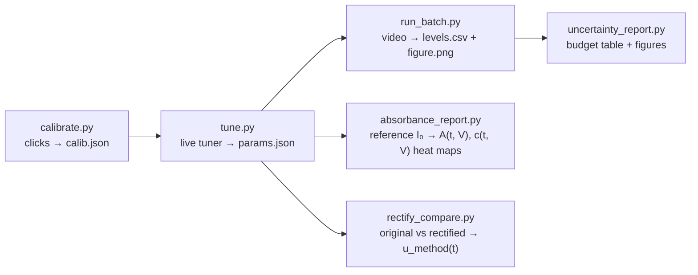
```mermaid
flowchart LR
    A["calibrate.py<br/>clicks → calib.json"] --> B["tune.py<br/>live tuner → params.json"]
    B --> C["run_batch.py<br/>video → levels.csv + figure.png"]
    C --> D["uncertainty_report.py<br/>budget table + figures"]
    B --> E["absorbance_report.py<br/>reference I₀ → A(t, V), c(t, V) heat maps"]
    B --> F["rectify_compare.py<br/>original vs rectified → u_method(t)"]
```

## Install

```bash
git clone https://github.com/Camedpc/liquid-foam-interface-volume-detector.git
cd liquid-foam-interface-volume-detector
pip install -r requirements.txt      # opencv-python, numpy, scipy, matplotlib, pillow
pip install -e .                     # optional: import cylvision from anywhere
```

Python 3.10 or newer. The interactive tools open OpenCV and Tkinter windows; the library and the tests do not need a display.

## Quick start

```bash
# 1. click the graduations on one frame  ->  runs/pour/calib.json + calibration_check.png
python scripts/calibrate.py --video pour.mp4 --cylinder 1000 --back --out runs/pour

# 2. tune the detector live               ->  runs/pour/params.json
python scripts/tune.py --video pour.mp4 --run-dir runs/pour --polarity lower_brighter

# 3. process the video                    ->  runs/pour/levels.csv + meta.json + figure.png (±u bands)
python scripts/run_batch.py --video pour.mp4 --run-dir runs/pour --step 5

# 4. (optional) uncertainty budget         ->  runs/pour/uncertainty_*.png + uncertainty.json
python scripts/uncertainty_report.py --run-dir runs/pour --video pour.mp4 --frame 108
```

If the video was already sub-sampled (for example one frame in 60 of a long recording, keeping the source fps in the metadata), pass `--frame-scale 60` to `tune.py` and `run_batch.py` so that the frame counter and `t_sec` show the source time.

## How the detection works

The detector only looks at the **sign of $G_y$** along the cylinder axis. Image rows grow downwards, so $G_y > 0$ where the picture gets brighter going down. Which sign belongs to which interface depends on the lighting, and one parameter, `polarity`, tells it:

<table>
<tr>
<td align="center" width="70%">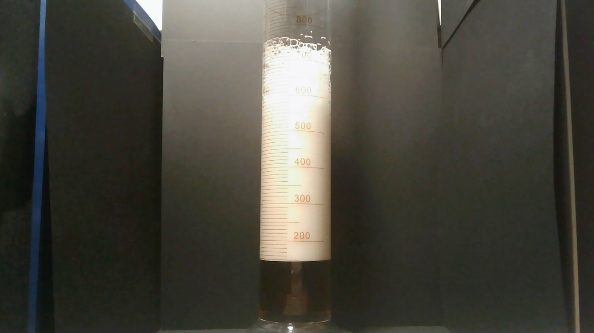<br><em>Front-lit, black background (frame 2472, t = 124.2 s): bright white foam over dark beer, dark air above.</em></td>
<td align="center" width="30%">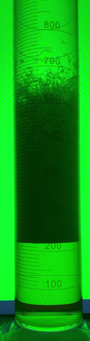<br><em>Back-lit green screen (frame 108, t = 172 s after the pour): the beer transmits the light, the foam scatters it and looks dark. The recording is a 470 × 1766 crop around the cylinder.</em></td>
</tr>
</table>

| `polarity` | setup | lower interface (liquid/foam) | upper interface (foam/air) |
|---|---|---|---|
| `lower_darker` | front-lit, black background | dark beer under bright foam → $G_y < 0$ | bright foam under dark air → $G_y > 0$ |
| `lower_brighter` | back-lit green screen | bright beer under dark foam → $G_y > 0$ | dark foam under bright air → $G_y < 0$ |

The two interfaces always have opposite signs, so the code works on $S = \pm G_y$ (sign $-1$ for `lower_darker`, $+1$ for `lower_brighter`): the lower interface is always a positive peak of $S$ (drawn in red), the upper one a negative peak (drawn in teal).

**Two ordered passes.** The lower interface is found first: per column, the row of the maximum of $S$, validated by $S > T_\text{lower}$, averaged over $|x - c_x| \le r_\text{lower}$. The upper interface is then searched **bottom-up from $y_\text{lower}$**: the first row where $-S > T_\text{upper}$, averaged over $|x - c_x| \le r_\text{upper}$. Foam is porous and every bubble edge creates a small gradient of the "upper" sign, so a raw per-column argmax would pick a random bubble somewhere inside the foam; scanning upwards from the liquid returns the *lowest* transition above threshold, which is the foam top. A **connected-component filter** (`min_h_upper`) removes the isolated 1–2 px bubble edges from the teal mask before the scan, keeping only blobs at least that many rows tall.

<table>
<tr>
<td align="center" width="50%">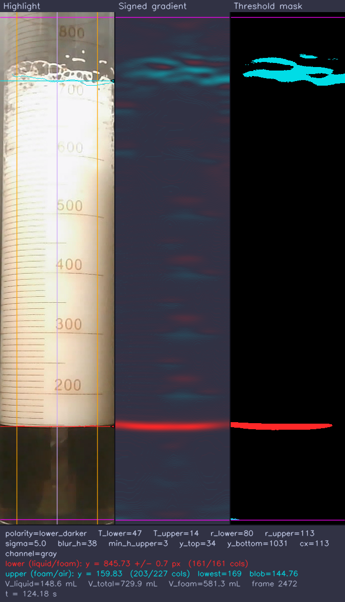<br><em><code>lower_darker</code> on the black run: red blob at the beer/foam interface (y = 845.7 px, 161/161 columns, 148.6 mL), teal blobs at the foam top (y = 159.8 px, 203/227 columns, 729.9 mL); the foam band (581 mL) is shaded between them.</em></td>
<td align="center" width="50%">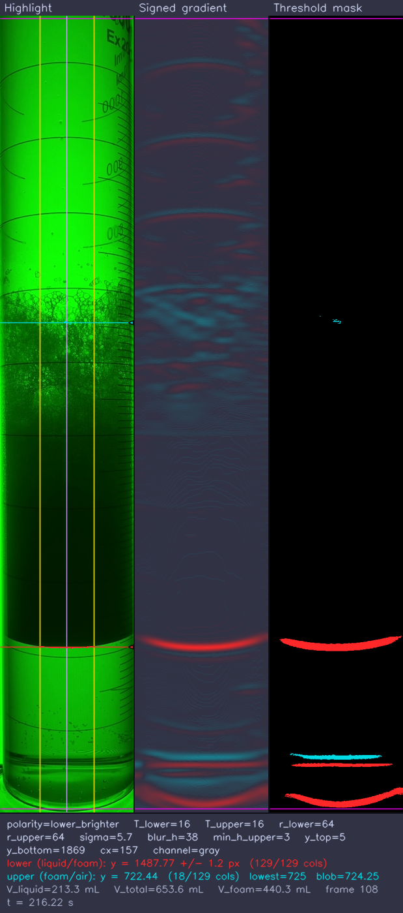<br><em><code>lower_brighter</code> on the green run: same colours, flipped physics. Lower y = 1258.2 px ± 1.7 px (221.8 mL, 267/343 columns), upper y = 431.7 px (653.0 mL, 237/343 columns), foam 431 mL. The teal blobs above the foam top are the bubbly upper layer of the foam; the bottom-up scan stops on the lowest one.</em></td>
</tr>
</table>

The three analysis panels shown above and in the tuner:

| panel | what it shows |
|---|---|
| **Highlight** | the crop with the shaded foam / liquid zones and their volumes, the per-column detections (dots), the mean rows (red = lower, teal = upper), the band edges (orange/yellow), the axis `cx` (thin mauve line) and the `y_top` / `y_bottom` masks (magenta) |
| **Signed gradient** | the heat map of $S = \pm G_y$ after Gaussian and horizontal smoothing: red = lower-interface sign, teal = upper-interface sign |
| **Threshold mask** | $S > T_\text{lower}$ in red and $-S > T_\text{upper}$ in teal — what the detector is allowed to pick |

<p align="center">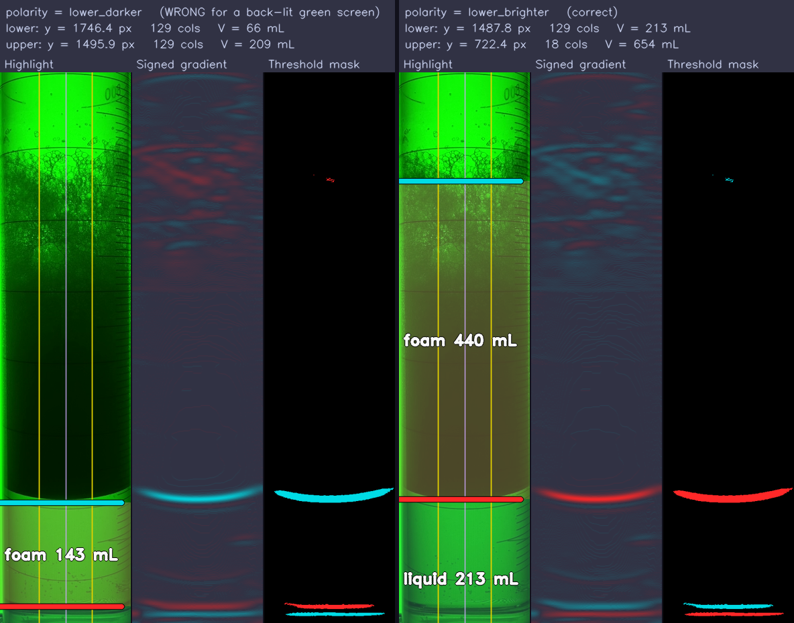</p>

*The same green-screen frame with the wrong polarity (left) and the right one (right). With `lower_darker` the detector locks on the wrong sign: nothing passes the "lower" threshold (0 columns) and the real beer/foam interface is reported as the "upper" one (y = 1267.1 px, 217 mL, 341 columns) — no foam band, no readout. With `lower_brighter`: liquid 222 mL, total 653 mL, foam 431 mL.*

## Tool 1 — Scale calibration (`scripts/calibrate.py`)

One still frame, a handful of clicks. The script asks, in order, for the **left** and **right** edges of the cylinder (the crop band), the **top** and **bottom** rows (`y_top` / `y_bottom`, the gradient masks), then every graduation of the preset. Pixel-accurate pointing is the whole point, so the cursor is a *logical* cursor with a ×8 loupe.

<p align="center">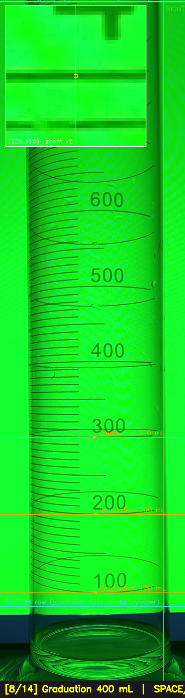</p>

*Prompt 8 of 14 on the green run: the four ROI clicks are placed (left 73, right 415, y_top 4, y_bottom 1534) and the 100, 200 and 300 mL graduations are marked in orange; the cursor sits at (238, 915) on the 400 mL ring, magnified ×8 in the top-left loupe. The 700–1000 mL rings lie above the frame and are skipped with `s`.*

Three models are fitted on the clicks $(y_i, V_i)$:

| model | form | behaviour |
|---|---|---|
| PCHIP | monotone cubic interpolation | exact at the clicks, follows any irregularity of the printed scale |
| poly2 | $V = a y^2 + b y + c$ | smooth, absorbs one noisy click |
| Möbius | $V = \dfrac{a y + b}{c y + 1}$ | the exact pinhole + tilt law; $c = 0$ means no camera pitch |

`best_model` keeps **poly2 when its RMS residual is ≤ 0.3 mL**, otherwise **PCHIP**. On both runs below poly2 lands at 0.43–0.56 mL, so the calibration honours the actual rings with PCHIP.

<table>
<tr>
<td align="center" width="50%">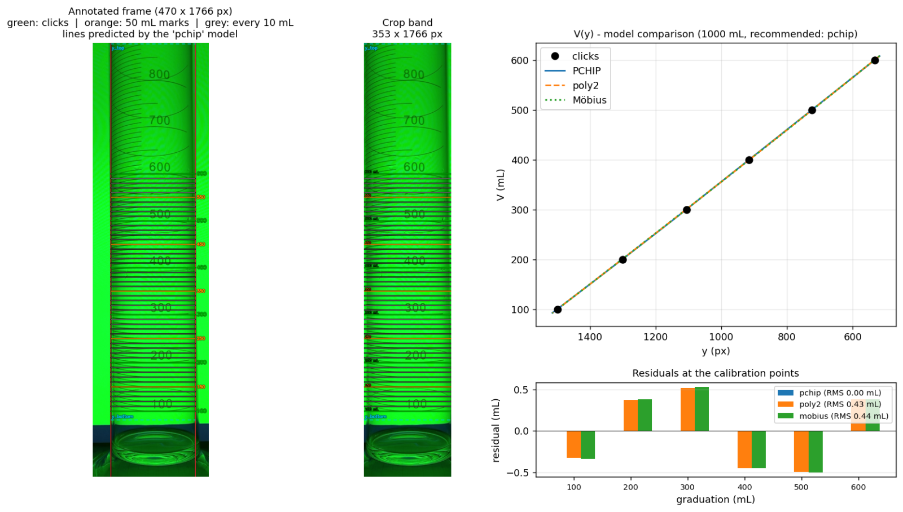<br><em>Green run (470 × 1766 frame, crop 343 × 1766): 6 clicks from 100 to 600 mL (the rings above are out of frame). RMS: PCHIP 0.00, poly2 0.43, Möbius 0.44 mL.</em></td>
<td align="center" width="50%">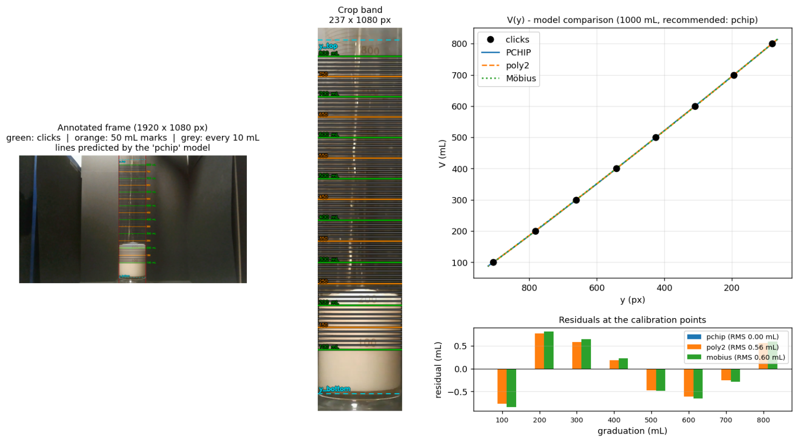<br><em>Black run (1920 × 1080 frame, crop 237 × 1080): 8 clicks from 100 to 800 mL. RMS: PCHIP 0.00, poly2 0.56, Möbius 0.60 mL.</em></td>
</tr>
</table>

The three panels of `calibration_check.png`: the annotated frame with every graduation line predicted by the recommended model (green = clicks, orange = 50 mL marks, grey = 10 mL marks), the crop band alone, and $V(y)$ for the three models with their residuals.

<details>
<summary><b>Click keys, <code>calib.json</code> keys and cylinder presets</b></summary>

| key / action | effect |
|---|---|
| mouse | moves the cursor 1:1 |
| **Shift** + mouse | damped pointer: one logical pixel every few mouse pixels |
| arrows | nudge by exactly 1 px (the mouse is ignored for 400 ms afterwards) |
| **Space** or left click | place the point at the logical cursor |
| `f` | toggle a 1:1 fullscreen window |
| `s` | skip a graduation that lies outside the frame |
| `z` | undo the last point |
| **Enter** | validate (all prompts answered, at least three graduations) |
| **Esc** | abort |

`calib.json` keys: `image_ref`, `image_size`, `cylinder` (spec), `x_left`, `x_right`, `y_top`, `y_bottom`, `graduations_ml`, `graduations_px_y`, `graduations_px_x`, `skipped_ml`, `poly2_coef`, `mobius_popt`, `mobius_pcov`, `residuals_ml`, `recommended_model`, and with `--back`: `graduations_px_y_back`, `graduations_px_x_back`, `back_calibration_frame`. Legacy files with a sibling `crop.json` are read transparently.

**Presets** (`cylvision/calibration/store.py`):

| preset | graduations to click (mL) | inner radius | scale step |
|---|---|---|---|
| `50` | 5, 10, 20, 30, 40, 50 | 1.35 cm | 1 mL |
| `1000` | 100, 200, …, 1000 | 3.20 cm | 10 mL |

Any other cylinder: `--cylinder custom --graduations 25,50,75,100 --radius-cm 1.8 --name "100 mL"`. The radius only feeds the curvature term of the uncertainty budget; `--back` (click the same rings on the back face) makes the budget independent of it.

</details>

## Tool 2 — Interface tuner (`scripts/tune.py`)

The tuner shows one frame through the detector and lets you move every parameter while watching the result: the specimen panel (full frame, shaded zones, braces with the volumes), the three analysis panels and the info strip.

<p align="center">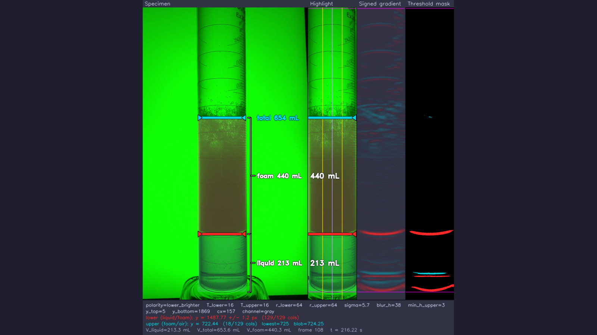</p>

*Inline layout on the green run (frame 108, t = 172.2 s): specimen, highlight, signed gradient, threshold mask and the info strip. Liquid 221.8 mL, liquid + foam 653.0 mL, foam 431.2 mL. The recording has no margin right of the cylinder, so the specimen panel drops its braces and readouts here; the highlight panel carries them inside the zones.*

<p align="center">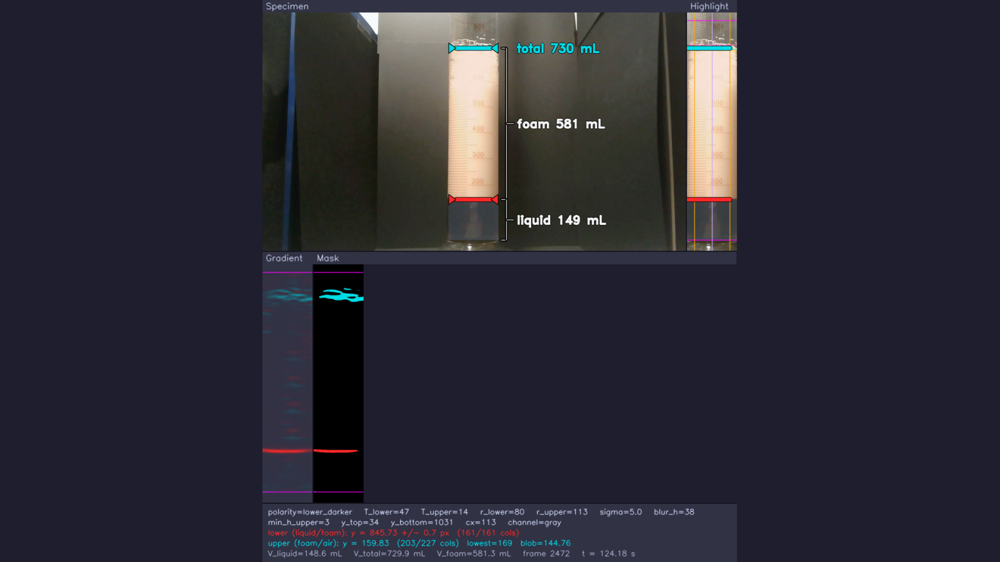</p>

*Stacked layout on the black run (frame 2472): specimen and highlight on the first row, gradient and mask on the second, info strip below. Liquid 148.6 mL, liquid + foam 729.9 mL, foam 581.3 mL.*

The **info strip** repeats the parameters and prints, for each interface, the mean row, its per-column spread, the number of valid columns in the band, and the volumes `V_liquid`, `V_total`, `V_foam` through the calibration.

### Control panel

<p align="center">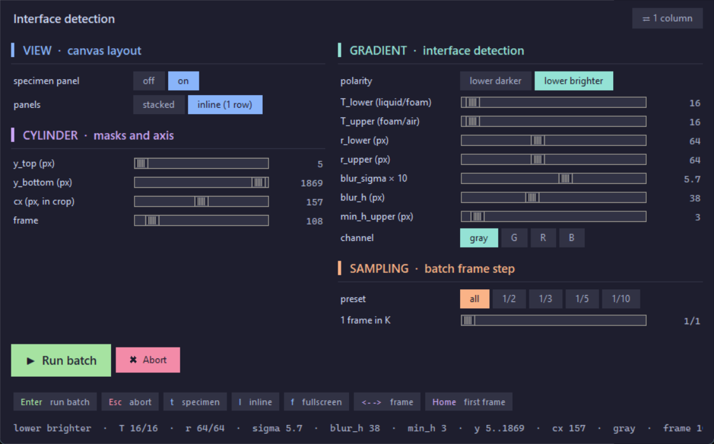</p>

*The Tk panel in two-column layout, loaded with the parameters of an earlier green-screen recording (`lower brighter`, T 16/16, r 64/64, σ 5.7, blur_h 38, min_h 3, y 5..1869, cx 157, gray, every frame). The run used in the figures below is tuned to T 40/8, r 171/171, min_h 15, y 4..1534, cx 171.*

**▶ Run batch** saves `params.json` (parameters + `frame_step`) and prints the batch command; **✖ Abort** leaves the run directory untouched; **⇄ 1/2 columns** rebuilds the panel in one or two columns. The footer shows the hotkeys of the OpenCV window and a one-line summary of the current values.

<details>
<summary><b>Every widget of the panel (VIEW, CYLINDER, GRADIENT, SAMPLING) and the hotkeys</b></summary>

#### VIEW (blue)

| widget | what it does | when to change it |
|---|---|---|
| `specimen panel` — radio [off \| **on**] | shows the full frame with the two interfaces, the shaded zones and the braces | turn off on a small screen to give the analysis panels more room |
| `panels` — radio [stacked \| **inline (1 row)**] | one row of panels, or two rows | stacked suits a short, wide crop (landscape video) |

#### CYLINDER (mauve)

| widget | range · default | what it does | when to change it |
|---|---|---|---|
| `y_top` | 0..H−1 · from `calib.json` | zero the gradient above this row (glass rim) | if the rim or the pouring stream shows up in the mask |
| `y_bottom` | 0..H−1 · from `calib.json` | zero the gradient below this row (base, table) | if the base edge shows up in the mask |
| `cx` | 0..W_crop−1 · W_crop // 2 | axis column *inside the crop*, centre of both bands | if the crop is not centred on the cylinder |
| `frame` (video only) | 0..N−1 | the frame shown | to check the parameters on a pour, a plateau, a collapse |

#### GRADIENT (teal)

| widget | range · default | what it does | when to change it |
|---|---|---|---|
| `polarity` — radio [**lower darker** \| lower brighter] | | sign convention of both interfaces (see above) | front-lit black background → lower darker; back-lit → lower brighter |
| `T_lower` | 0..500 · 40 | threshold on $S$ for the liquid/foam interface | raise until the red mask keeps only the interface |
| `T_upper` | 0..500 · 47 | threshold on $-S$ for the foam/air interface | raise if the teal mask has blobs inside the foam |
| `r_lower` | 0..r_max · min(80, r_max) | half-width of the averaging band of the lower interface | narrow if the walls bend the interface; `r ≥ W_crop // 2` = whole width |
| `r_upper` | 0..r_max · min(80, r_max) | same for the upper interface | independent of `r_lower` |
| `blur_sigma × 10` | 0..100 · 5.0 | Gaussian smoothing (σ in px) before the Sobel derivative | raise if bubble edges compete with the interface |
| `blur_h` | 0..101 · 38 | horizontal box filter width (px), 0 = off | keep on for foam; it averages each row along $x$ |
| `min_h_upper` | 0..50 · 3 | minimum blob height of the teal mask (0/1 = off) | raise during a pour with big bubbles |
| `channel` — radio [**gray** \| G \| R \| B] | | grey level fed to the detector | pick the channel that carries the contrast of your lighting |

#### SAMPLING (peach)

| widget | range · default | what it does |
|---|---|---|
| `preset` — radio [**all** \| 1/2 \| 1/3 \| 1/5 \| 1/10] | | sets `frame_step` to 1, 2, 3, 5 or 10 |
| `frame_step` — "1 frame in K" | 1..60 · 1 | the batch analyses one frame in K |

#### Hotkeys of the OpenCV window

| key | effect |
|---|---|
| **Enter** | accept the parameters and run the batch |
| **Esc** | abort |
| `t` | toggle the specimen panel |
| `l` | toggle inline / stacked |
| `f` | fullscreen |
| ← → (or `a` / `d`) | previous / next frame |
| **Home** (or `0`) | first frame |
| **Space** | play / pause |

</details>

### What each parameter does to the detection

Each figure shows the same frame with one parameter changed; the highlight panel carries the shaded zones and volumes so the effect is visible at a glance, and the caption strip gives the numbers.

<p align="center">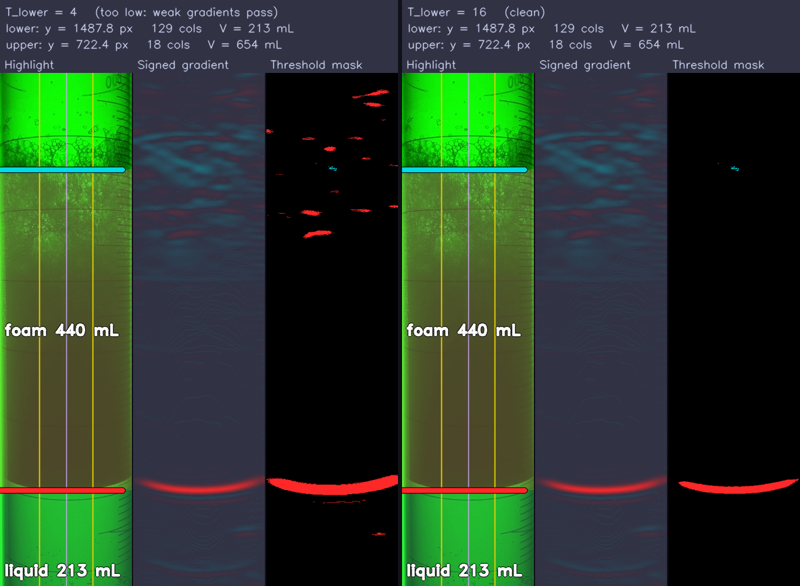</p>

*`T_lower` 4 vs 40 (green run). Both values give almost the same lower interface (1257.3 vs 1258.2 px) because the argmax already lands on the true interface, but at 4 every one of the 343 columns is validated and the red mask is littered with weak gradients in the foam and below the beer — every one of them a candidate the moment the interface weakens. 40 keeps only the interface (267 columns, the walls excluded).*

<p align="center">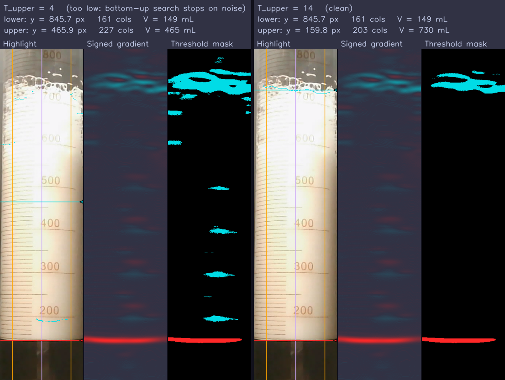</p>

*`T_upper` 4 vs 14 (black run). The bottom-up scan stops on the first row above threshold: at 4 it stops on bubble reflections right above the beer, y = 465.9 px (465 mL) instead of the foam top at 159.8 px (730 mL) — the shaded "foam" band collapses to 316 mL instead of 581 mL. The teal mask on the left shows the ladder of false candidates it climbed.*

<p align="center">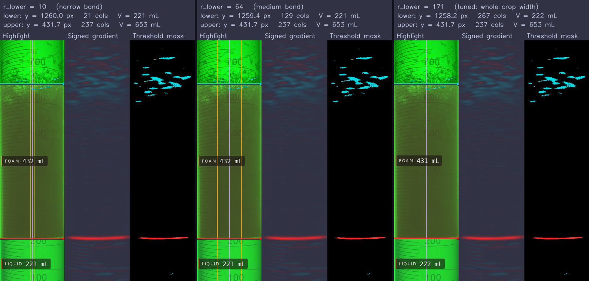</p>

*`r_lower` 10, 64 and 171 (green run). A narrow band uses 21 columns (1260.0 px, 220.9 mL); a medium one 129 columns (1259.4 px, 221.2 mL); the tuned band spans the whole crop (171 = half the crop width), 267 columns, 1258.2 px (221.8 mL). On this recording the interface is flat across the cylinder and the threshold already drops the wall columns, so the three agree within 1 mL; the narrow band is nevertheless the one to use when the meniscus bends the interface near the glass.*

<p align="center">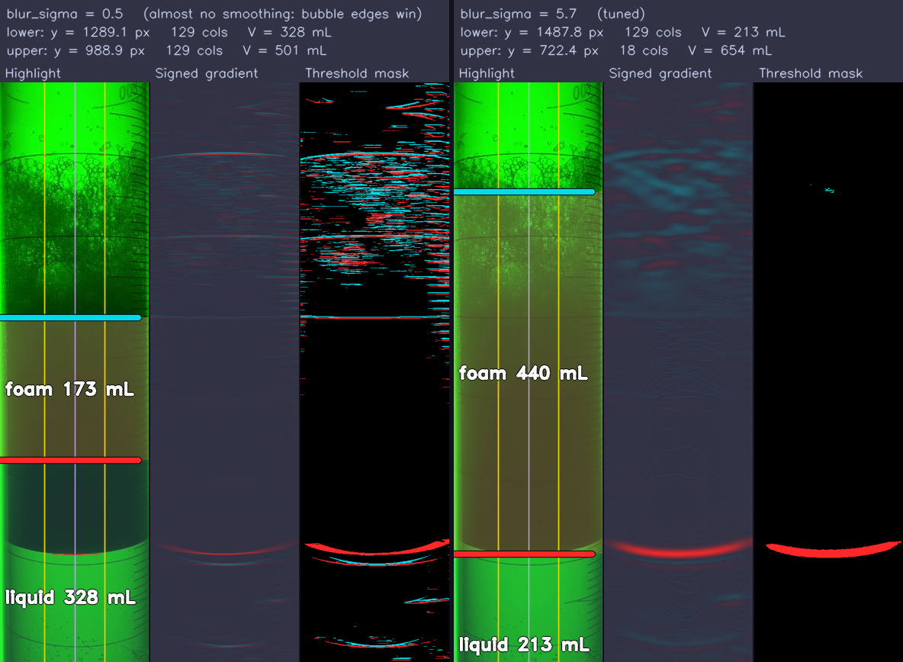</p>

*`blur_sigma` 0.5 vs 5.7 (green run). With almost no smoothing every bubble edge passes the upper threshold: the teal mask is a cloud of strokes and the bottom-up scan stops on the first of them, 523.6 px (605 mL) instead of the foam top at 431.7 px (653 mL) — the shaded foam band loses 48 mL. The lower interface, a strong edge, survives either way (1258.4 vs 1258.2 px).*

<p align="center">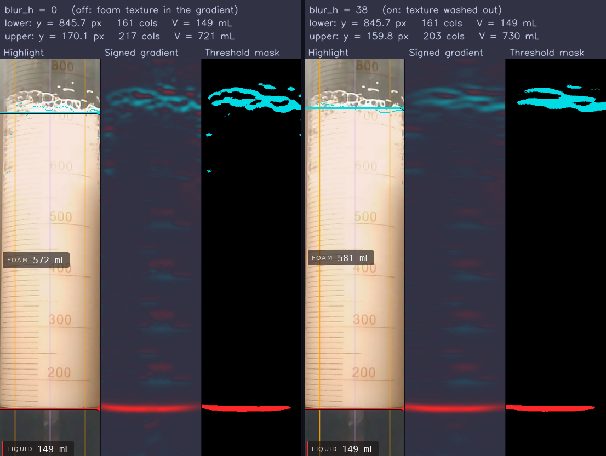</p>

*`blur_h` 0 vs 38 (black run). The horizontal box filter averages each row along $x$, keeping horizontal interfaces and washing out the vertical texture of the foam: the teal blobs in the foam disappear, the upper interface moves from 170.1 px (721 mL, 217 columns) to 159.8 px (730 mL, 203 columns). The lower interface does not move (845.7 px).*

<p align="center">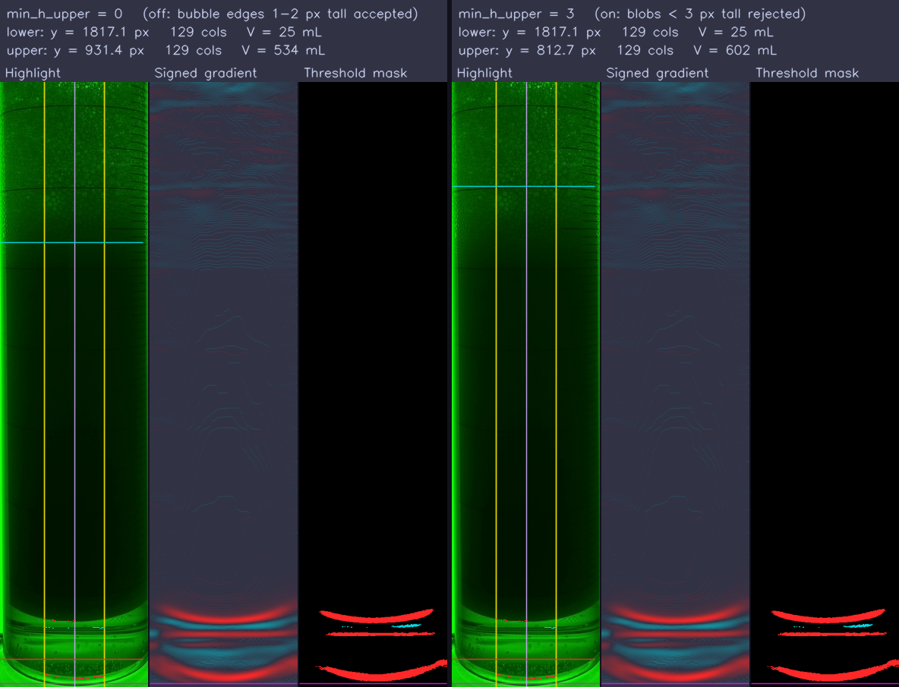</p>

*`min_h_upper` 0 vs 15 (green run, frame 108, zoom on the foam top). Without the filter the bottom-up scan stops on a thin bubble edge inside the foam, y = 461.0 px (638 mL, 305 columns); with blobs at least 15 rows tall it reaches the foam top at 431.7 px (653 mL, 237 columns) — a 29 px, 15 mL difference that grows during the pour, when the foam is full of large bubbles.*

<p align="center">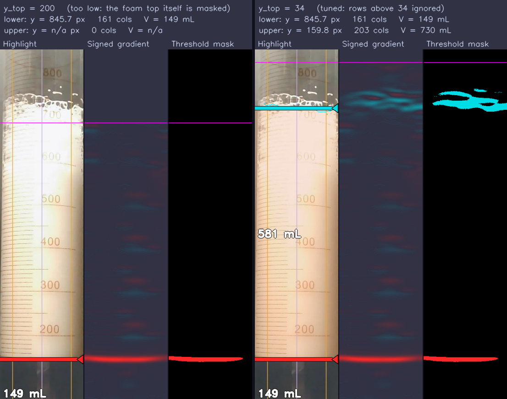</p>

*`y_top` 200 vs 34 (black run). The rim of both test cylinders lies outside the frame, so the mask is shown the other way round: a `y_top` below the foam top (magenta line at 200) masks the true upper interface and the detector reports nothing (0 columns, no foam band); at 34 the foam top is found at y = 159.8 px (730 mL). The lower interface is unaffected (845.7 px in both cases).*

<p align="center">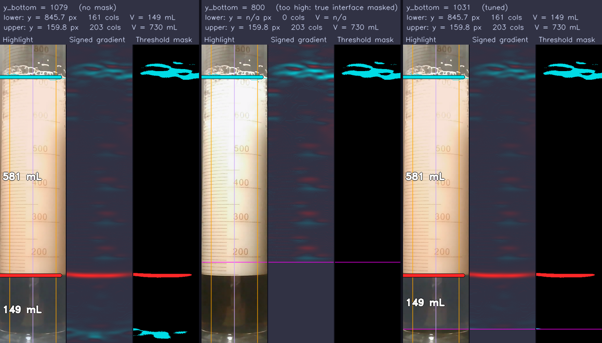</p>

*`y_bottom` 1079 (no mask), 800 (too high) and 1031 (tuned), black run. Without the mask the bright edge of the base appears as a teal blob at the bottom of the mask — harmless here, but it is what the upper-interface scan would fall on whenever the lower interface is lost. At 800 the mask covers the beer/foam interface itself (0 columns, nothing shaded). The effect of the mask on these particular frames is otherwise nil: 845.7 / 159.8 px in both valid cases.*

<p align="center">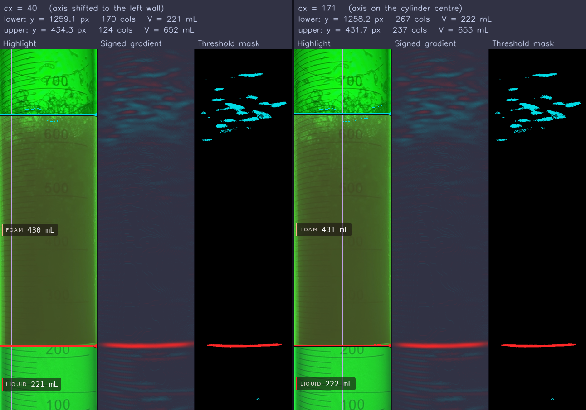</p>

*`cx` 40 vs 171 (green run). With the axis shifted to the left wall the band is clipped to the columns near the glass (170 lower / 124 upper columns instead of 267 / 237): lower 1259.1 px (221.4 mL) and upper 434.3 px (651.7 mL) instead of 1258.2 / 431.7 px. The shift is small here because the interfaces are flat, but half the band is wasted outside the crop.*

<p align="center">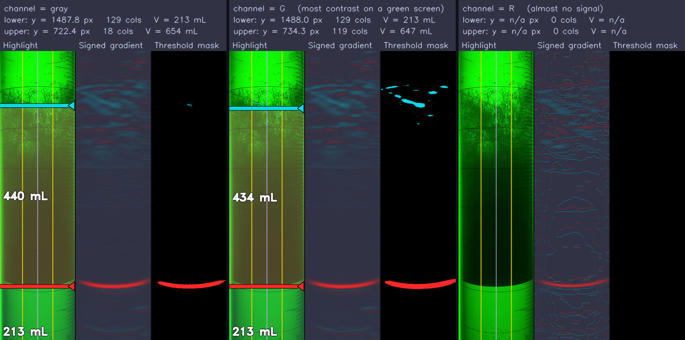</p>

*`channel` gray / G / R (green run). Gray (tuned) and G give the same lower interface (1258.2 vs 1258.0 px); G has more contrast on a green screen and validates 338 upper columns instead of 237, but its stronger bubble edges stop the scan 32 px below the foam top (463.6 px, 636 mL, instead of 431.7 px, 653 mL). R carries almost no signal: the gradient panel is noise and nothing passes the thresholds.*

## Tool 3 — Batch (`scripts/run_batch.py`)

Reads `calib.json` and `params.json`, processes frames `--start .. --end` one in `--step` (default: the `frame_step` saved by the tuner) and writes `levels.csv`, `meta.json` and `figure.png` into the run directory.

<table>
<tr>
<td align="center" width="50%">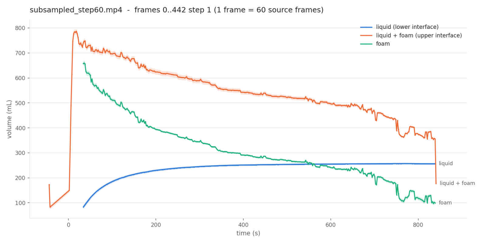<br><em>Green run, frames 0..442 (1 frame = 60 source frames, t = 0 at the pour), 443 rows, the lower interface found on 403 of them and the upper on 422. Liquid + foam peaks at 787 mL, the liquid rises to a 257 mL plateau as it drains out of the foam, the foam decays from 660 mL to 99 mL in 14 min with a visible step at the collapse (t ≈ 12.5 min). The stray points before t = 0 and at the very end are the empty cylinder and the last frame.</em></td>
<td align="center" width="50%">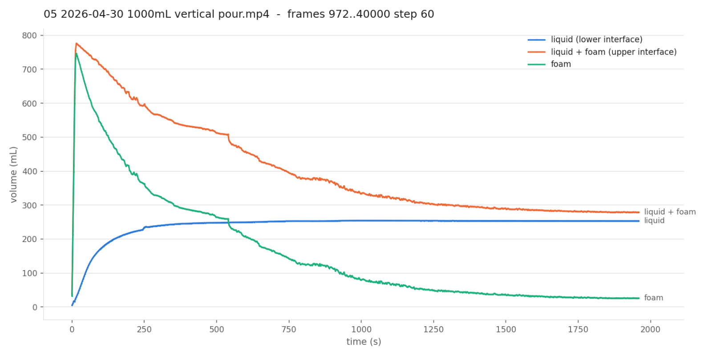<br><em>Black run, frames 972..40000 step 60, 651 frames analysed. Liquid + foam peaks at 776.4 mL and ends at 278.9 mL; the liquid plateau is 253.1 mL; the foam decays from 746.7 mL to 25.8 mL in 33 min.</em></td>
</tr>
</table>

Both figures carry the $\pm u_\text{total}$ band of the uncertainty budget (about 3 mL), which is barely wider than the lines at this scale. The liquid + foam curve of the green run gets jumpy after t ≈ 700 s as the foam top turns into a sparse layer of large bubbles; the per-frame `u_method_upper_mL` column records it.

<p align="center">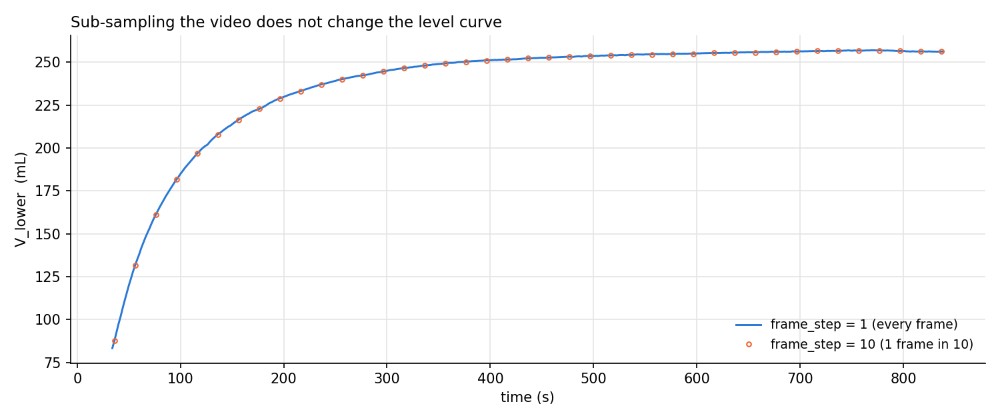</p>

*Green run, $V_\text{lower}(t)$ at `frame_step` 1 (line) and 10 (circles): sub-sampling ten times does not change the curve. The spike at the start is the pour crossing the band.*

<details>
<summary><b>Files of a run directory and columns of <code>levels.csv</code></b></summary>

| file | written by | content |
|---|---|---|
| `calib.json` | `calibrate.py` | crop band, masks, clicks, fitted models |
| `calibration_check.png` | `calibrate.py` | the verification figure above |
| `params.json` | `tune.py` | `DetectionParams` + `frame_step` |
| `levels.csv` | `run_batch.py` | one row per frame (NaN rows for skipped frames keep the time axis aligned) |
| `meta.json` | `run_batch.py` | video, frame range, step, parameters, timings, summaries, the Markdown budget table (`uncertainty_budget`) |
| `figure.png` | `run_batch.py` | $V_\text{lower}(t)$, $V_\text{total}(t)$, $V_\text{foam}(t)$ with the $\pm u_\text{total}$ bands of the uncertainty budget (drawn whenever the calibration carries the cylinder radius; otherwise the batch says so and draws the lines alone) |
| `uncertainty_curvature.png`, `uncertainty_schematic.png`, `uncertainty_budget.png` | `uncertainty_report.py` | the figures of the budget section |
| `uncertainty.json` | `uncertainty_report.py` | geometry, per-volume table, notes, method summary |

`levels.csv` columns:

| column | meaning |
|---|---|
| `frame_idx`, `t_sec` | frame index and time (× `--frame-scale` for a pre-subsampled video) |
| `y_lower_px`, `std_lower_px`, `n_lower` | mean row of the liquid/foam interface, its per-column standard deviation, valid columns |
| `y_upper_px`, `n_upper` | mean row of the foam/air interface, valid columns |
| `V_lower_mL` | liquid volume, $V(y_\text{lower})$ |
| `V_total_mL` | liquid + foam, $V(y_\text{upper})$ |
| `V_foam_mL` | $V_\text{total} - V_\text{lower}$ |
| `u_method_lower_mL`, `u_method_upper_mL` | per-frame method uncertainty of each interface (see below) |

</details>

## Absorbance: seeing inside the foam

The two interfaces say how much foam there is, not what it is made of. On the back-lit setup the foam is dark because it *scatters* the light of the green screen, and it scatters more when it holds more liquid (more films, thicker Plateau borders). Comparing every frame with a picture of the **empty cylinder** under the same light turns that darkness into a number per pixel, then into a profile along the height, then — with one mass balance — into the liquid content of the foam. `scripts/absorbance_report.py` does it on a whole video; the figures below come from a third run (back-lit, 1000 mL cylinder, 1 frame = 60 source frames, the pour starting at source frame 1347).

<p align="center">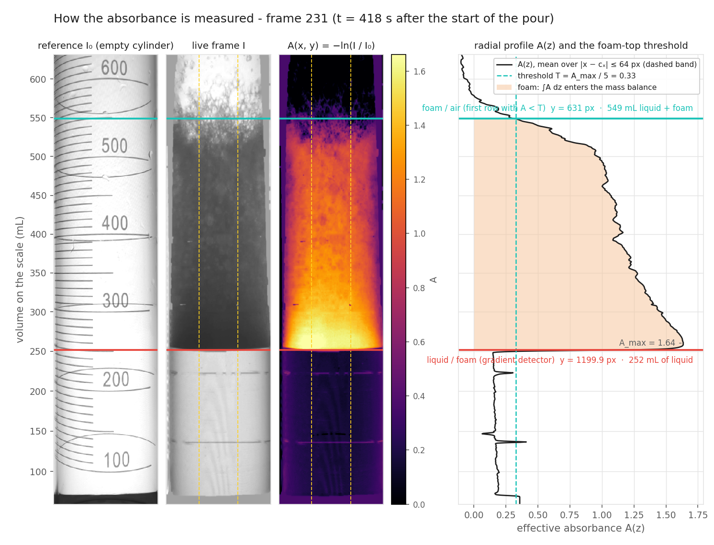</p>

*Frame 231 (t = 418 s after the start of the pour). Left to right: the reference $I_0$ (mean of frames 5–14, empty cylinder; the printed marks are the pixels that get masked), the live frame, the absorbance map $A(x, y)$ and the radial profile $A(z)$ averaged over the dashed band $|x - c_x| \le 64$ px. The red line is the liquid/foam interface from the gradient detector (y = 1199.9 px, 251.6 mL); the teal line is the foam top from the threshold on the profile: $A_\text{max} = 1.64$, $T = A_\text{max}/5 = 0.33$, first row above the liquid with $A < T$ at y = 631 px (548.7 mL), so 297.1 mL of foam. The shaded area $\int A\,dz$ is what enters the mass balance. Below the liquid line the profile sits at $A \approx 0.15$: the beer itself absorbs a little; the two spikes near 145 and 135 mL are printed rings that the dead-pixel fill did not fully remove.*

**Step by step.**

1. **Reference.** $I_0(x, y)$ is the per-pixel mean of $N = 10$ consecutive frames of the empty, back-lit cylinder before the pour (`--ref-frames 5:15`), on the green channel (the colour of the screen). Pixels darker than `dead_thresh` = 178 in the reference — printed graduations and numbers, glass defects — are not measurements of the back-light: they are masked, the mask is dilated by `dead_dilate` = 2 px, and the masked pixels are replaced by the mean of their valid neighbours (a mask-aware box filter of radius 5 px). The same fill is applied to every live frame, then both are blurred with the same Gaussian ($\sigma$ = 1 px), so that $I$ and $I_0$ are treated identically.

2. **Absorbance map.** For each live frame,

$$A(x, y) = -\ln\frac{\max(I(x, y), 1)}{\max(I_0(x, y), 1)}.$$

   Because the reference is per pixel, the non-uniformity of the screen, the vignetting of the lens and the glass cancel out in the ratio. This is Beer–Lambert *in form only*: the attenuation is multiple scattering by the foam films, not absorption, so $A$ is an **effective** extinction $\mu_\text{eff}\,d$ along the optical path $d$ through the cylinder — monotone in the amount of liquid on the path, but not a calibrated absorption coefficient. $A$ is not clamped below zero: a negative value means the frame is brighter than the reference, i.e. the back-light drifted.

3. **Profile.** $A(z) = \langle A(x, z)\rangle_{|x - c_x| \le r_\text{dens}}$ with $r_\text{dens}$ = 64 px, narrower than the cylinder so that the dark glass walls stay out of the average.

4. **Foam top by threshold.** $A_\text{max} = \max A(z)$ over $[y_\text{top}, y_\text{liquid})$ and $T = A_\text{max}/k$ with $k$ = 5. Scanning **upwards from the liquid/foam interface** (which the gradient detector reads sharply), the first row with $A(z) < T$ is the foam/air interface. When the top of the foam is diffuse — big bubbles, a surface that breathes — the gradient threshold hesitates between bubble edges while the absolute level of $A$ does not; scanning bottom-up returns the lowest exit of the foam, so foam left on the glass higher up is ignored.

5. **Mass balance.** The liquid held inside the foam is the beer missing from the bottom, $V_\infty - V_\text{beer}(t)$, where $V_\infty$ is the final liquid volume once the foam is gone (`--v-inf auto` takes the maximum of $V_\text{beer}$ over the run: 256.96 mL here). Writing the liquid volume fraction of the foam as $c(z) = \gamma A(z)$ and integrating over the foam column of section $S$:

$$\gamma(t) = \frac{V_\infty - V_\text{beer}(t)}{S \displaystyle\int_\text{foam} A(z)\,dz}, \qquad c(z, t) = \gamma(t)\,A(z, t),$$

   with $S = \pi D^2/4$ = 35.3 cm² ($D$ = 6.7 cm bore) and $dz$ = 1 px / (`px_per_cm`). By default the vertical scale is taken from the calibration itself, $\text{px\_per\_cm} = S / |dV/dy|$ (68.1 px/cm here), which makes $S\int A\,dz$ consistent with the volumes read on the scale: $c$ is then a true volume fraction, and $S\int c\,dz$ gives back the missing beer. $c$ is NaN outside the foam. (Multiplying by the density of the beer, 1.016 g/mL, gives the g/mL of the original analysis.)

<p align="center">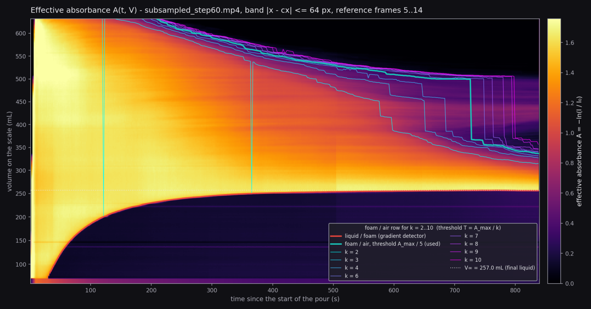</p>

*$A(t, V)$: every column is one profile $A(z)$ with the rows converted to mL through the calibration (frames 23–442, one every 2 s of source time). Red: the liquid/foam interface from the gradient detector — the liquid climbs from 83 mL at t = 33 s to its 257 mL plateau (dotted line) in about 300 s. Teal: the foam top for the $k$ used (5); the thin lines are $k$ = 2…10 (threshold from $A_\text{max}/2$ to $A_\text{max}/10$). The foam peaks at 644.5 mL at t = 33 s and collapses from 242.9 to 110.9 mL between t = 725.8 and 727.8 s (the foam top drops from 500 to 366 mL in one frame). The dark region under the red line is the beer ($A \approx 0.15$).*

<p align="center">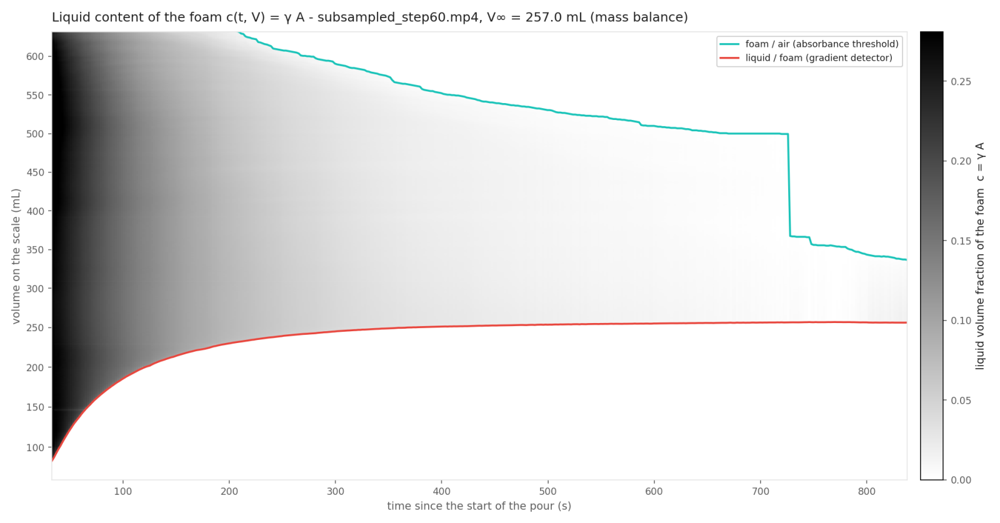</p>

*$c(t, V) = \gamma A$, the liquid volume fraction of the foam (inverted grey: black = wet, white = dry or no foam). At t = 33 s the foam holds 174 mL of beer in 644 mL of foam: 27 % on average, 22 % at its base, 6 % at its top. At t = 171 s it is 8 % (35 mL in 428 mL), at t = 418 s 1.8 % (5.3 mL in 297 mL), and by the collapse at t ≈ 727 s the beer has settled (0.4 mL missing): what is left is a dry foam that the mass balance can barely see.*

**What the heat maps show.** Drainage. Right after the pour the foam is wet everywhere and wettest at the bottom, where the liquid it is losing accumulates before crossing into the beer; the liquid front (red) climbs while the foam top (teal) sinks, and between them the foam dries from the top down — the top of the foam turns white on $c(t, V)$ long before its base does. The absorbance itself decays more slowly than the liquid content (the drained foam still scatters), which is why $A(t, V)$ stays bright while $c(t, V)$ fades: $\gamma$ falls from 0.18 at t = 33 s to 0.016 at 418 s and 0.002 at 726 s. The collapse at t ≈ 727 s is a coarsening/rupture event of a foam that had become almost dry, not a drainage step: it removes 132 mL of foam and only 0.4 mL of beer.

```bash
python scripts/absorbance_report.py --video run09/subsampled_step60.mp4 --run-dir run09 \
    --params run09/params_gradient.json --ref-frames 5:15 --frame-scale 60 --t0-frame 1347 \
    --start 23 --k 5 --r-dens 64 --v-inf auto --measurement-frame 231 --out-dir out/run09
# options: --px-per-cm auto|68  --section-cm2 35.3  --channel G  --light-blur 1  --dead-thresh 178  --dead-dilate 2  --step 1
```

The report needs the run's `calib.json` and the gradient parameters of the liquid/foam interface (`params.json`, or `--params`); it writes `absorbance.npz` (`A` and `c` as `n_frames × H` arrays, `t`, `frame_idx`, `z`, `y_liquid`, `y_foam_top`, `gamma`), `absorbance.csv` (per frame: `y_liquid_px`, `y_foam_top_px`, `V_beer_mL`, `V_foam_mL`, `A_max`, `threshold`, `integral_A_cm`, `gamma`), `absorbance_meta.json` and the three figures above. `t_sec` is counted from `--t0-frame` (a source-frame index) so that t = 0 is the start of the pour.

**Caveats.**

- *Effective, not Beer–Lambert.* $A$ compares the foam with the empty cylinder, nothing more. It depends on the bubble size as well as on the liquid content (smaller bubbles scatter more for the same liquid fraction), so $c = \gamma A$ assumes the absorbance is proportional to the liquid content within one frame; the mass balance fixes the scale frame by frame, not the shape.
- *A stable back-light.* Any drift of the screen between the reference frames and the live frames goes straight into $A$ (a 5 % brightening reads as $A = -0.05$ everywhere). The sign of $A$ in the air above the foam is the check: it should stay at 0.
- *$k$ is a tuning parameter.* The foam top moves with the threshold — on frame 231, $V_\text{foam}$ reads 265.7 mL for $k$ = 2, 286.6 (3), 292.9 (4), **297.1 (5)**, 301.8 (6), 302.8 (7), 304.4 (8), 306.0 (9) and 313.3 mL for $k$ = 10: ±2 % between $k$ = 4 and 8, ±8 % over the whole sweep. The thin lines of the $A(t, V)$ map show the same spread over the run; $k$ = 2 occasionally falls into a hole of low absorbance inside the foam (the spikes at t ≈ 120 s and 365 s), which is why a bottom-up scan needs a threshold well below $A_\text{max}$.
- *The vertical scale of the mass balance.* $\gamma$ and $c$ scale as $1/(S\,dz)$: with the section of the preset and `px_per_cm` from the calibration the numbers above are volume fractions; with another `--px-per-cm` (the original analysis used 20 px/cm, 3.4× too small for this video) the maps keep their shape but the colour bar changes by that factor.
- *Dead pixels.* 43 % of the crop is masked on this run (the walls of the glass and the base are dark in the reference too), which is harmless because the profile only uses the central band; inside the band the mask is the printed marks, whose residue is visible as thin horizontal lines on both maps.

## Uncertainty budget

Every volume comes with a standard uncertainty ($k = 1$) built from four independent terms. The full derivation is in [`docs/uncertainty.md`](docs/uncertainty.md); this is the summary. Whenever a quantity is only known to lie in an interval of width $w$, the uniform-distribution rule $u = w / \sqrt{12}$ is used.

**Calibration.** The RMS residual of the recommended model, floored by the resolution of the printed scale ($\delta_s$ = the thin step, 10 mL on a 1000 mL cylinder):

$$u_\text{cal} = \max\left(\sqrt{\tfrac{1}{n}\sum_i \varepsilon_i^2},\; \frac{\delta_s}{\sqrt{12}}\right) = 2.89\ \text{mL on the 1000 mL runs.}$$

**Pixel quantisation.** A row is an integer; with the local slope $s(V) = |dV/dy|$ (≈ 0.57 mL/px here):

$$u_\text{px}(V) = \frac{1\ \text{px}}{\sqrt{12}}\; s(V) \approx 0.16\ \text{mL}.$$

**Cylinder curvature.** A graduation, or the interface, is a horizontal *circle* of radius $R$; a camera at distance $D$ sees it as an arc of ellipse, so the columns of the band sample different rows. The full vertical span of the arc inside the band, $\Delta(V)$, is treated as a uniform reading error:

$$u_\text{curv}(V) = \frac{\Delta(V)}{2\sqrt{3}}\; s(V), \qquad \Delta \approx |v_\text{click} - c_y| \left(\frac{r}{f}\right)^2 \frac{1-\rho}{2\rho}\quad (\rho = R/D).$$

$\Delta$ vanishes on the **camera horizon** (the row $c_y$ where the circle is seen edge-on), grows linearly away from it and quadratically with the band half-width $r$. The geometry ($\rho$, $c_y$, $f$, pitch $\alpha$) is recovered from the calibration alone: with front **and back** clicks the two rows of the same ring give $\rho = (s_f - s_b)/(s_f + s_b)$ and the horizon is where the two lines cross — no focal length, no physical radius (`focal_free`); with front clicks only, the radius preset and the Möbius $c$ coefficient are used instead (`mobius_tilt`).

<p align="center">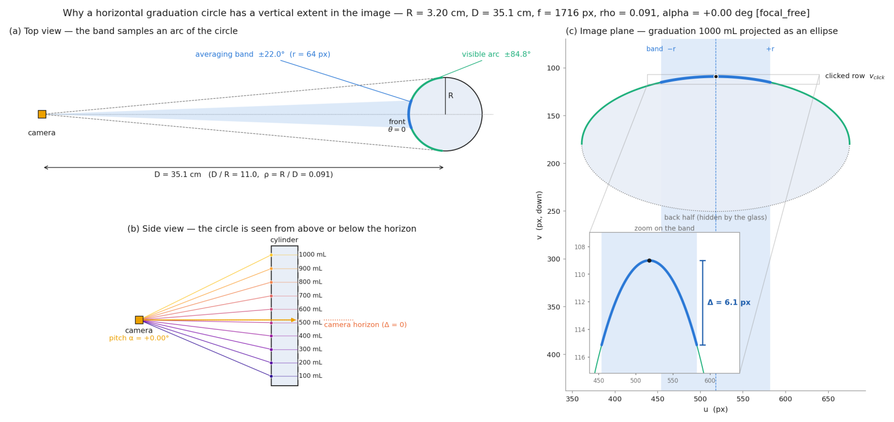</p>

*Green run geometry (R = 3.20 cm, D = 35.1 cm, f = 1716 px, ρ = 0.091, α = 0, focal-free): (a) top view, the ±22.0° band samples a piece of the ±84.8° visible arc; (b) side view, the camera looks along the 500 mL ring; (c) the 1000 mL ring projected as an ellipse, Δ = 6.1 px across the band.*

<p align="center">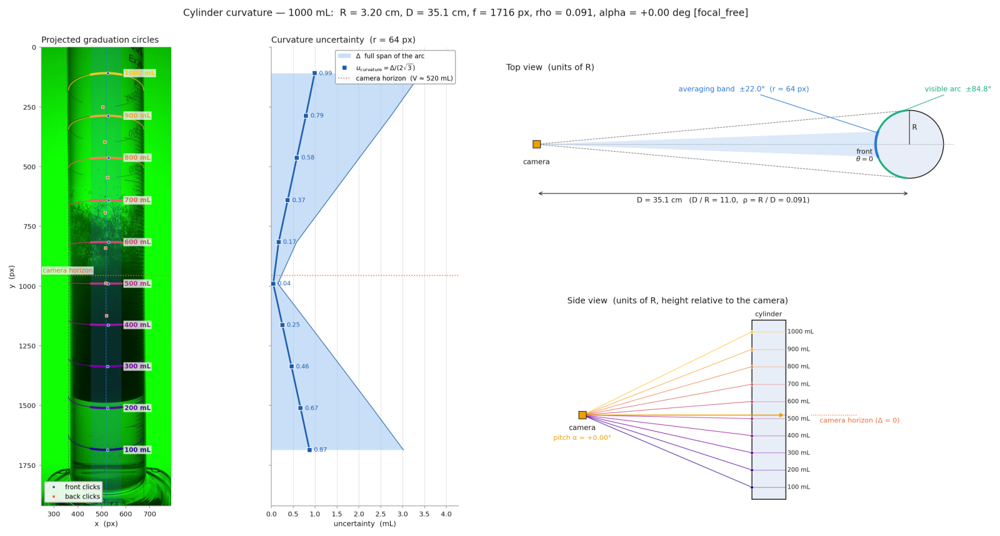</p>

*Left: the projected circle of every graduation over the real frame (front clicks in blue, back clicks in red), curving up below the horizon (y ≈ 955 px, V ≈ 520 mL) and down above it. Centre: the Δ wedge and $u_\text{curv}(V)$: 0.04 mL at 500 mL, 0.87 mL at 100 mL, 0.99 mL at 1000 mL. Right: top and side views of the recovered geometry.*

**Method.** For each frame and interface, the valid per-column rows are converted to volumes, columns farther than $t$ = 7 mL from the mean are dropped (a column that jumped to a bubble is a failure of the method, not a property of the interface), and the spread of the rest gives

$$u_\text{method,frame} = \frac{|V(y_\text{up}) - V(y_\text{lo})|}{2\sqrt{3}}.$$

The run-level value is the **median** over the frames.

<p align="center">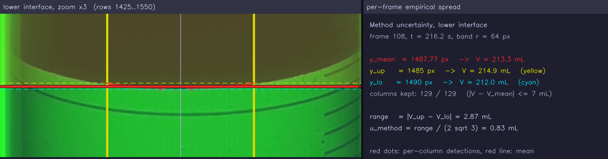</p>

*Lower interface of the green run (frame 108, zoom ×3, foam wash above the line, liquid wash below): 267 per-column detections (red dots) around the mean row 1258.24 px (221.8 mL), dashed bounds 1253 px (224.5 mL, yellow) and 1261 px (220.4 mL, cyan), range 4.08 mL, $u_\text{method}$ = 1.18 mL on this frame; the median over the 403 frames of the batch is 1.04 mL (mean 1.13, p95 1.74 mL).*

**Total**, in quadrature:

$$u_\text{total}(V) = \sqrt{u_\text{cal}^2 + u_\text{px}(V)^2 + u_\text{curv}(V)^2 + u_\text{method}^2}.$$

<p align="center">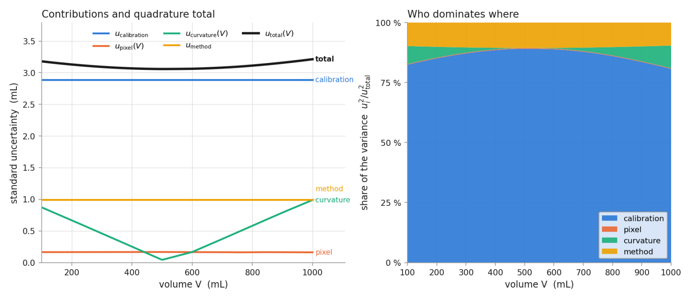</p>

*Green-screen geometry: contributions and total versus volume (left) and the share of the variance (right). The scale resolution dominates everywhere; curvature only matters at the ends of the cylinder; the pixel term is negligible. The three budget figures and the table below come from an earlier green-screen recording of the same setup, calibrated with front and back clicks (the run of the figures above has front clicks only, so its budget would use the `mobius_tilt` geometry).*

| V (mL) | u_cal | u_px | u_curv | u_method | **u_total** |
|---:|---:|---:|---:|---:|---:|
| 100 | 2.89 | 0.16 | 0.87 | 0.99 | **3.18** |
| 250 | 2.89 | 0.17 | 0.56 | 0.99 | **3.11** |
| 500 | 2.89 | 0.17 | 0.04 | 0.99 | **3.06** |
| 750 | 2.89 | 0.16 | 0.48 | 0.99 | **3.09** |
| 1000 | 2.89 | 0.16 | 0.99 | 0.99 | **3.21** |

*Green run, 1000 mL cylinder, r = 64 px, PCHIP calibration, method term = median of `u_method_lower_mL` over 955 frames (mean 0.96, p95 1.47 mL).*

```bash
python scripts/uncertainty_report.py --run-dir runs/pour --video pour.mp4 --frame 108
# options: --r-px 64  --alpha-deg 0  --no-back  --levels-csv other.csv  --volumes 100,250,500,750,1000
```

The report prints the geometry and the Markdown table above and writes `uncertainty_curvature.png`, `uncertainty_schematic.png`, `uncertainty_budget.png` and `uncertainty.json` into the run directory. The method term is read from `levels.csv`; without a batch the budget carries a placeholder and says so.

## Reducing the uncertainty: rectifying the cylinder

The method term is not only the roughness of the interface. A horizontal cross-section of the cylinder — a graduation ring, the liquid/foam interface — is a circle, and the camera sees it as an arc of ellipse: below the camera horizon the arc bends up towards the walls, above it bends down. The detector averages the interface row over a band of columns, so the vertical span of the arc inside the band goes straight into the per-column spread, on top of the real irregularity of the interface. The curvature term of the budget models exactly that span, but it can also be removed at the source.

<table>
<tr>
<td align="center" width="50%">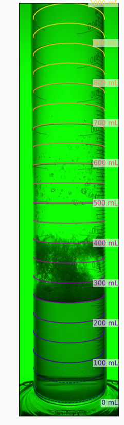<br><em>Before: the rings of the focal-free model (ρ = 0.091, horizon at 520 mL) drawn on a green-screen frame. The 100 mL ring, 730 px below the horizon, spans 5.3 px across a 64 px band.</em></td>
<td align="center" width="50%">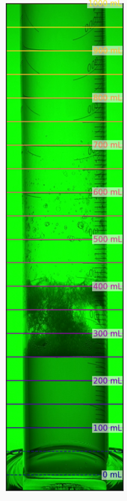<br><em>After: the same frame through the inverse projection — every ring is a horizontal line, the printed scale on the right is undistorted and the background is untouched. Both images were produced with the original analysis code.</em></td>
</tr>
</table>

**Inverse projection.** With $\rho = R/D$ and the horizon row $c_y$ from the focal-free fit, the projected axis column $c_x$ and the silhouette half-width $a$ (px), the circle whose front point is at row $v_\text{click}$ projects, without tilt, to

$$u(\theta) - c_x = \frac{a \sin\theta \sqrt{1-\rho^2}}{1 - \rho\cos\theta}, \qquad v(\theta) - c_y = \frac{(v_\text{click} - c_y)(1-\rho)}{1 - \rho\cos\theta}.$$

The rectified image takes its column linear in $\sin\theta$ and its row equal to the front row of the circle through the pixel, so `cv2.remap` reads every output pixel $(x, y)$ at

$$\sin\theta = \frac{x - c_x}{a}, \qquad x_\text{in} = c_x + \frac{a \sin\theta \sqrt{1-\rho^2}}{1 - \rho\cos\theta}, \qquad y_\text{in} = c_y + \frac{(y - c_y)(1-\rho)}{1 - \rho\cos\theta},$$

and is the identity outside the cylinder ($|\sin\theta| > 1$). The axis column is a fixed point, so the front graduation clicks keep their rows and the calibration $y \to V$ is used as it is on the rectified frames (`cylvision.rectify.rectify_calibration` only drops the back clicks, which no longer mean anything). `rectification_maps(geom, W, H)` builds the two maps from the `CameraGeometry` of the budget; `rectify_frame` applies them; `compare_video` runs the detector on both versions of every frame.

<p align="center">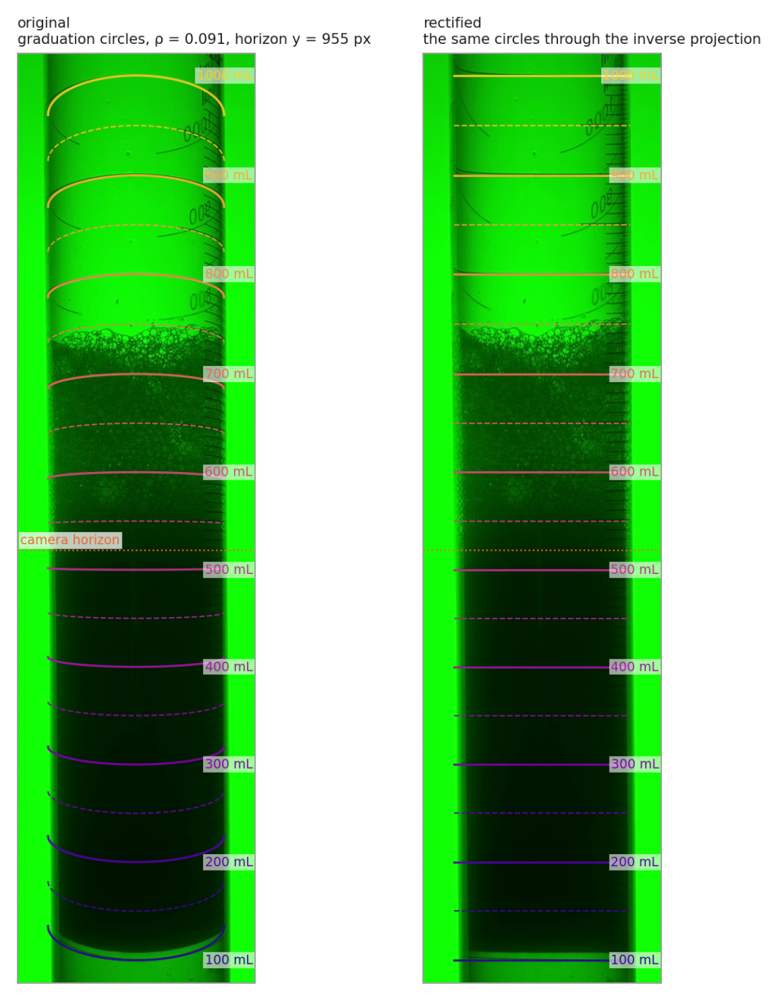</p>

*Source frame 2250 of the run with back clicks (75 s into the recording, liquid at 111 mL): the graduation circles of the focal-free geometry every 50 mL (plasma ramp, solid = clicked rings), and the same circles pushed through the inverse projection on the rectified frame. The bottom rings, whose arcs sag by up to 60 px across the silhouette, become flat; the printed scale on the right wall stays where it was.*

<p align="center">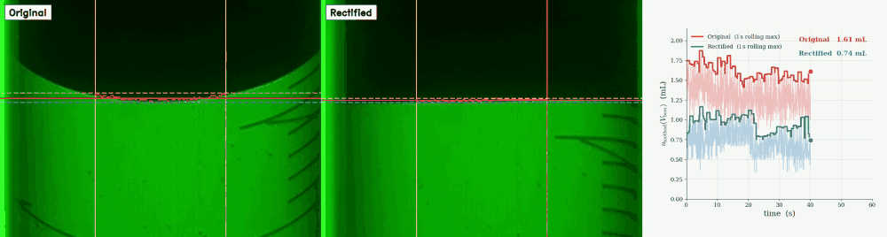</p>

*Original (left) and rectified (centre) zoom on the liquid/foam interface, source frames 2250–4047 (60 s) of the same run, with the per-column detections, the mean row and the dashed empirical bounds; right, the live $u_\text{method}(t)$ of both (1 s rolling max in bold). Produced with the original analysis code; shown here as a 20 s, 6 fps excerpt of the 60 s video (the plot builds up over the full minute).*

<p align="center">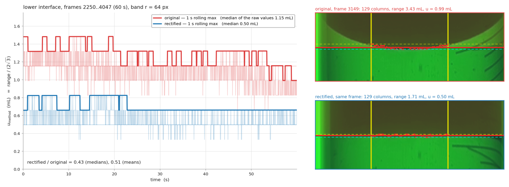</p>

*The same 60 s through `cylvision`: per-frame $u_\text{method}$ of the lower interface on the original and on the rectified crop (thin: raw values, bold: 1 s rolling max, dotted: medians), and the frame in the middle of the window (source frame 3149, liquid at 157 mL) before and after rectification — 129 columns in both cases, range 3.43 mL → 1.71 mL, $u_\text{method}$ 0.99 → 0.50 mL.*

| window: source frames 2250–4047, 60 s, 1798 frames, `T_lower` 16, `r_lower` 64 px | original | rectified | ratio |
|---|---:|---:|---:|
| $u_\text{method}$ = range / (2√3), **median** | 1.15 mL | **0.50 mL** | **0.43** |
| $u_\text{method}$ = range / (2√3), mean | 1.09 mL | 0.56 mL | 0.51 |
| $u_\text{method}$ = range / (2√3), p95 | 1.32 mL | 0.66 mL | 0.50 |
| max half-range / √3 (definition of the original analysis), median | 1.27 mL | 0.67 mL | 0.53 |
| max half-range / √3, 1 s rolling max, mean | 1.57 mL | 0.90 mL | 0.57 |

*Run `10 1000mL final results pour beer` (green screen, 1000 mL cylinder, focal-free geometry ρ = 0.091, horizon y = 955 px), lower interface rising from 109 to 180 mL during the window. The rectified reading is 1.1 mL lower on average than the original one: the mean over the band of the original crop includes the upward-bent wings of the arc, the rectified one reads the front row, which is what the calibration clicks measured. The original analysis reported about 1.45 mL → 0.95–1.0 mL on the same clip with its own detector, the max/√3 definition and the 1 s rolling max: the same halving. The budget definition gives smaller numbers because the range is divided by 2√3 instead of taking the larger half-range over √3 (equal only for a symmetric spread), and because it reads the raw values, not their rolling maximum.*

```bash
python scripts/rectify_compare.py --video pour.MOV --run-dir runs/pour --params runs/pour/params.json \
    --start 2250 --n-frames 1798 --out runs/pour/rectify
# options: --walls detect   measure the glass walls on three frames instead of using the calibration crop
#          --which upper    --tol-ml 7   --scatter-frame N   --graduation-frame N
```

The script writes `rectify_compare.csv` (per frame: rows, volumes, bounds, both definitions of $u_\text{method}$ for both images), `rectify_summary.json` (geometry, statistics, ratios) and the two figures above.

**Caveats.** The mapping needs the focal-free geometry, i.e. **back clicks** on a few graduations (`calibrate.py --back`): with front clicks only, the horizon row is a guess and the rectification would bend the arcs the wrong way as often as the right one. The model has no tilt (the focal-free fit absorbs a small pitch into the horizon row) and assumes a right circular cylinder. The curvature term of the budget is the same arc seen by the model: with the exact geometry it vanishes after rectification (Δ = 4.6 px → 0 at the 160 mL level, r = 64 px), and what survives is the error of the geometry — 0.6 px for ρ off by 0.01, 0.2 px for a horizon off by 20 px — so keep the term in the budget with that residual rather than dropping it. The gain is the halving of the method term at the ends of the cylinder; on the horizon the arcs are already flat and there is nothing to gain.

## Project layout

```
liquid-foam-interface-volume-detector/
├── cylvision/
│   ├── io.py                  unicode-safe image IO, VideoSource, key codes
│   ├── magnifier.py           ×8 loupe for pixel-accurate clicks
│   ├── rectify.py             cylinder rectification: inverse-projection maps, before/after comparison,
│   │                          wall edges, residual curvature, the two figures
│   ├── calibration/           models.py (PCHIP / poly2 / Möbius), clicks.py, back_clicks.py,
│   │                          store.py (Calibration, PRESETS, JSON), check.py (verification figure)
│   ├── detection/             gradient.py (Sobel, masks), interfaces.py (DetectionParams, two-pass
│   │                          detector), panels.py (highlight / gradient / mask, zone wash, readout
│   │                          boxes, specimen panel, info strip)
│   ├── ui/                    theme.py (palette, line geometry, wash, fonts), text.py (TrueType text
│   │                          via Pillow, Hershey fallback), controls_panel.py (Tk), frame_picker.py, tuner.py
│   ├── pipeline/              run_store.py (run directory), batch.py (CSV rows), plot.py (V(t))
│   ├── uncertainty/           curvature.py (camera geometry, Δ), empirical.py (method), budget.py
│   └── absorbance/            reference.py (I₀, dead pixels), beer_lambert.py (A map, A(z), foam top,
│                              mass balance), batch.py (video → A(t, z)), heatmap.py (figures)
├── scripts/                   calibrate.py · tune.py · run_batch.py · uncertainty_report.py ·
│                              absorbance_report.py · rectify_compare.py · make_readme_figures.py
├── docs/                      uncertainty.md (full derivation) · images/ (every README figure, the GIF + manifest)
├── tests/                     pytest, synthetic images only
├── SPEC.md                    internal engineering spec
├── pyproject.toml · requirements.txt · LICENSE
```

## Tests

```bash
pip install -e ".[dev]"
python -m pytest -q          # 105 passed in ~20 s
```

The tests need no video and no display: synthetic three-band crops (air / foam / liquid, both polarities, with noise) check that the detector finds both interfaces within ±2 px and that swapping the polarity breaks it; the calibration models, the legacy JSON layouts, the curvature geometry (Δ = 0 on the horizon, symmetric growth, $u = \Delta/(2\sqrt{3})$), the empirical spread, the batch/CSV round trip and the TrueType text helper (font lookup, anchors, backing box, Hershey fallback, readout alignment) are covered as well. `tests/test_absorbance.py` builds a uniform bright reference with printed marks and a darker foam band: the map recovers $-\ln(I/I_0)$, the dead-pixel fill leaves valid pixels untouched, the profile threshold finds the top of the band (and moves the right way with $k$ on a diffuse edge), $\gamma$ and $c$ integrate back to a known missing volume, and the three figures are written. `tests/test_rectify.py` draws the projected arc of a synthetic camera and checks that the remap turns it into a horizontal row within 1 px, that the mapping is the identity outside the cylinder and on the axis, that the residual curvature vanishes with the right geometry, that a curved two-band interface loses most of its spread once rectified, and that the wall-edge finder locates a bright cylinder.

## Regenerating the figures

Every image in `docs/images/` comes from a real run and is described, with its frame and parameters, in [`docs/images/README_figures.json`](docs/images/README_figures.json). To rebuild them from two run directories (a green-screen run with `lower_brighter` and a black-background run with `lower_darker`):

```bash
python scripts/make_readme_figures.py \
    --green-run runs/green --green-video green.mp4 --frame-scale-green 60 --t0-frame 22 \
    --black-run runs/black --black-video black.mp4 \
    --out docs/images --panel-screenshot
# --only hero,timeline,param_T_lower   regenerate a subset (timeline = strip + detection_timeline.gif)
# --skip-batch                         reuse the cached batch CSVs from --work-dir
# --reuse-batch black                  reuse only the black cache (the 5 GB seek), redo the green batch
# --t0-frame 22                        caption times count from this green frame (start of the pour)
# --only absorbance --absorbance-run runs/backlit --absorbance-video backlit.mp4 \
#     --absorbance-params runs/backlit/params_gradient.json     the absorbance figures (third run;
#     --absorbance-ref-frames 5:15 --absorbance-t0-frame 1347   the green/black runs are not needed)
# --only rectify --rectify-run runs/back --rectify-video back.MOV --rectify-params runs/back/params.json \
#     --rectify-start 2250 --rectify-n-frames 1798           the rectification figures (run with back clicks,
#                                                            full-frame-rate video; the owner media are registered as is)
```

The overlay style is set in `cylvision/ui/theme.py`: line geometry (`MEAN_LINE_W` = 3 px flat, `MEAN_LINE_SHADOW_W` = 1 px, `TRIANGLE_W/H`, `LEADER_DOT/GAP` for the dotted leader), wash colours and alphas (`FOAM_WASH_BGR`, `LIQUID_WASH_BGR`, `WASH_ALPHA_*`), and the readout typography (`LABEL_FONT_ZONE` = `DejaVuSans`, `LABEL_FONT_VALUE` = `DejaVuSansMono`, `LABEL_ZONE_SIZE`, `LABEL_VALUE_SIZE`, `LABEL_LETTER_SPACING`, `LABEL_BACKING_*`, `LABEL_BAR_W`). The fonts are the TrueType files shipped with matplotlib (`matplotlib.get_data_path()/fonts/ttf`), rendered with Pillow by `cylvision/ui/text.py`, so the figures come out identical on every machine; any other name from that folder (`DejaVuSerif`, `STIXGeneral`, `cmss10`, `cmtt10`...) or a path to a `.ttf` works, and OpenCV's Hershey font is used if Pillow or the file is missing. The wash and the labels can be switched off per call with `show_wash=False` / `show_labels=False` in `annotate_interfaces` and `make_specimen_panel`.

## License

MIT — see [LICENSE](LICENSE). © 2026 Camille Duparc.
